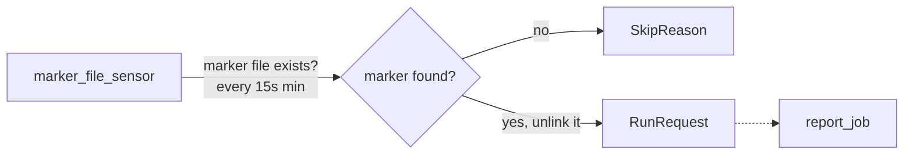

# marker_file_sensor

[← Dagster](dagster.md) | [Home](../../../setup.md)

---

Dagster's parallel to Airflow's Sensor — reacts to an external signal instead of a fixed schedule, same self-contained marker-file pattern as [`example_sensor`](../airflow/example_sensor.md).

📍 `services/dagster/user-code/definitions.py:322`



Turn it on from the **Sensors** tab (sensors default to off), then from *inside the `dagster-user-code` container specifically* — that's where sensor code actually executes, not `dagster-daemon` (bit this exact mismatch during development).

## Try it

```bash
docker exec dagster-user-code touch /tmp/io_manager_storage/.dagster_sensor_trigger
```

---

[← Dagster](dagster.md) | [Home](../../../setup.md)
