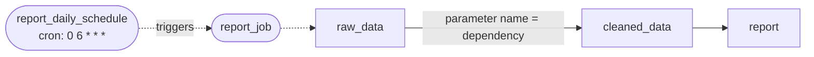

# report_pipeline (raw_data → cleaned_data → report)

[← Dagster](dagster.md) | [Home](../../../setup.md)

---

Dagster's actual differentiator, worth looking at closely: `cleaned_data`'s function signature is `def cleaned_data(raw_data: list[dict])` — that parameter name **is** the dependency declaration. Dagster inspects it and wires the lineage edge automatically; there's no `>>` operator or explicit DAG object anywhere, unlike the equivalent Airflow example ([`example_etl_pipeline`](../airflow/example_etl_pipeline.md)) which chains tasks explicitly.

📍 `services/dagster/user-code/definitions.py:119` (`raw_data`) / `:127` (`cleaned_data`) / `:135` (`report`) / `:158` (`report_job`, `report_daily_schedule`)



`report_job` + `report_daily_schedule` show the scheduling side — toggle the schedule on from the **Schedules** tab (needs `dagster-daemon` running, which it is) to have it run on its own at 6am daily instead of only on manual materialization.

Open `report` in the UI's asset graph to see the inferred lineage rendered.

## Try it

```bash
docker exec dagster-webserver dagster-graphql -r http://localhost:3000 -p launchPipelineExecution -v '{
  "executionParams": {
    "selector": {"repositoryLocationName": "user_code", "repositoryName": "__repository__", "pipelineName": "report_job"},
    "mode": "default"
  }
}'
```

---

[← Dagster](dagster.md) | [Home](../../../setup.md)
