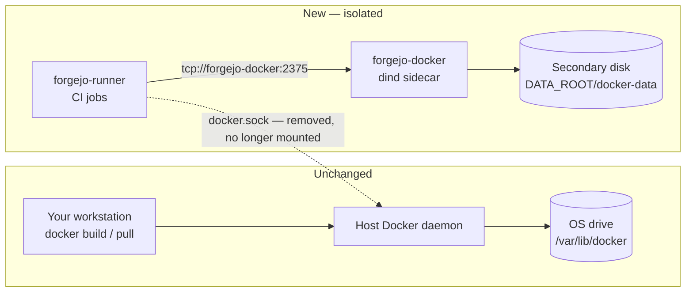
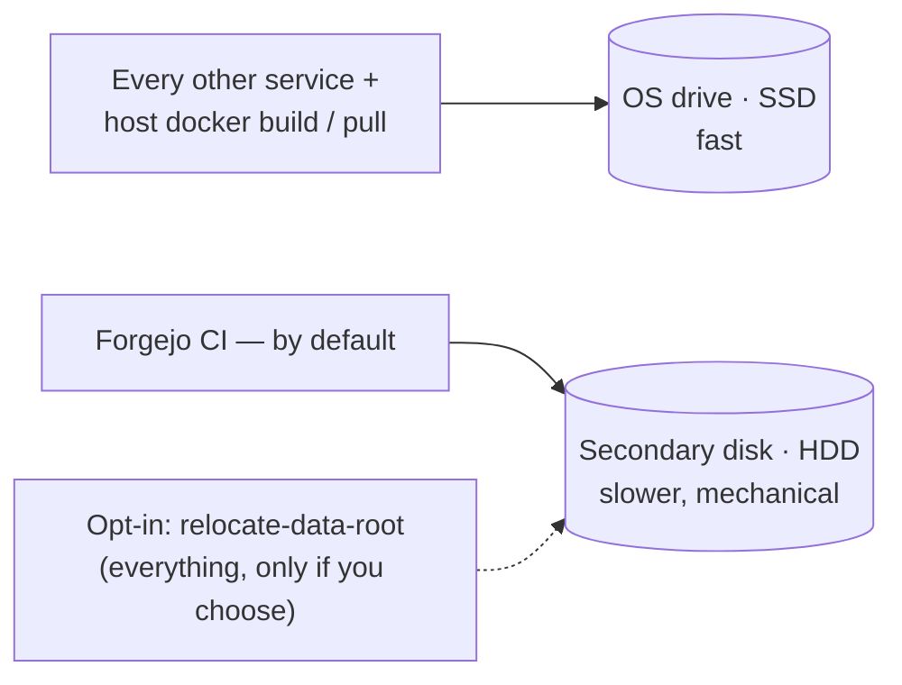

# Forgejo

[← Services Reference](../11-services-reference.md) | [Home](../../setup.md)

---

**Purpose:** Community-driven Git hosting — repos, issues, pull requests, CI/CD (Actions).
**Port:** `3002` (web), `2223` (SSH) | **Data:** `service_data/data/forgejo/` | **Requires:** Postgres | **Memory:** DB capped 384M in compose.yml; app: no hard limit set; measured idle ~199MB total (app 162 + db 37)

## Setup

```bash
cp services/forgejo/.env.example services/forgejo/.env
# set POSTGRES_PASSWORD (DOMAIN/ROOT_URL are derived from the root .env's DOMAIN, not set here)
uv run homeserver.py dev up forgejo
```

## Create an admin user

```bash
docker exec -it forgejo forgejo admin user create --username admin --password yourpassword --email admin@example.com --admin
```

## Notes

- Image: `codeberg.org/forgejo/forgejo:16.0.2`
- Config env vars use the `FORGEJO__` prefix
- Setup wizard is skipped via `FORGEJO__security__INSTALL_LOCK=true`
- `FORGEJO__server__ROOT_URL` must be `https://forgejo.${DOMAIN}` (not `http`) since Cloudflare always terminates TLS
- SSH clone port is `2223` on the host → `22` in the container
- Forgejo bundles 776 SPDX license templates, covering GitHub's documented license chooser list. Apache License 2.0 (`Apache-2.0`), GNU GPL v3.0-only (`GPL-3.0-only`), and MIT (`MIT`) are pinned to the top of the picker via `PREFERRED_LICENSES`; change the comma-separated IDs in `.env` to reorder them. Use `GPL-3.0-or-later` instead if repositories should permit later GPL versions.

## Migrated: `forgejo-db` from `postgres:18.4` to `postgres:18.4-alpine`

Done as a trial of moving other services' Postgres containers to the smaller Alpine-based image (~150MB smaller than the Debian-based default) — forgejo was picked as the safe/low-stakes service to validate the process on before touching anything with real production data.

**Why this can't be a simple image-tag swap:** Postgres bakes the OS's collation library into the data directory at `initdb` time. Alpine uses musl libc, the default image uses glibc — switching the image tag on an *already-initialized* volume silently leaves indexes sorted under a collation version that no longer matches the running library, which can corrupt sorted/text indexes without any obvious error at switch time. This is a well-documented footgun (see [docker-library/postgres#327](https://github.com/docker-library/postgres/issues/327)); the only safe path is a **logical migration** (`pg_dump`/`pg_restore`) into a freshly-initialized cluster, never reusing the old volume's on-disk files directly.

**Process used** — `homeserver.py` has this built in as two commands, `dump` and `migrate` (originally validated manually on forgejo first; now the standard tool for any service):

```bash
# 1. Dump the running DB — pg_dump (custom format) + pg_dumpall --roles-only,
#    saved to service_data/db_dump/forgejo/<timestamp>/
uv run homeserver.py dev dump forgejo

# 2. Migrate — stops forgejo, swaps compose.yml's image tag to postgres:18.4-alpine
#    and renames the volume (forgejo-postgres -> forgejo-postgres-alpine, so the
#    new image gets a genuinely fresh initdb rather than touching the old volume),
#    starts ONLY the DB on that fresh volume, applies the roles dump, restores
#    the main dump, then brings the rest of the service back up
uv run homeserver.py dev migrate forgejo

# 3. Verify before trusting it — compare row/table counts against a baseline
#    taken before step 1, and check a real API response (not just a DB ping)
#    actually reflects the old data:
docker exec forgejo curl -s http://localhost:3000/api/v1/users/search

# 4. Only after verification passes — migrate prints the exact command:
docker volume rm forgejo_forgejo-postgres
```

Confirmed working: user count, table count, and a real `/api/v1/users/search` response all matched pre-migration state exactly; no migration/collation errors in `forgejo` app logs on first boot against the restored DB.

**Two gotchas found migrating other services this same way** (both now handled automatically by `dump`/`migrate`, not manual steps):
- **`pg_restore` erroring on `CREATE TYPE`/`CREATE TABLE` colliding with objects that already exist** — e.g. an image whose `docker-entrypoint-initdb.d/` script bootstraps its own schema (guacamole's `01-schema.sql`) before the restore ever runs. Fixed with `--clean --if-exists --no-owner` on the restore (safe here specifically because the target is always a container created fresh for this migration).
- **An app authenticating as a DB role other than `POSTGRES_USER`** — Nextcloud creates its own `oc_admin` role during initial setup and points `config.php` at it; a per-database `pg_dump` never captures that (roles are cluster-wide, not database-scoped), so the role silently didn't exist after restore and Nextcloud crash-looped on auth failure. Fixed by also running `pg_dumpall --roles-only` at dump time and applying it *before* the main restore — and deliberately keeping (not stripping) the restore's `GRANT` statements, since those are exactly what a secondary role like `oc_admin` needs on the restored tables. An earlier attempt added `--no-privileges` to sidestep the ordering problem instead of fixing the ordering — that broke `oc_admin`'s actual table access (login worked, every query returned `permission denied`) and has since been removed; see `docs/services/nextcloud.md` for the full incident.

**Not every Postgres image has an Alpine variant.** `migrate <service>` only auto-infers `-alpine` for the plain official `postgres:<tag>` image (no registry prefix). A custom/extended image (e.g. `immich`'s `ghcr.io/immich-app/postgres` with vectorchord/pgvector baked in) requires an explicit target: `migrate <service> --image <repo:tag>` — there's no way to know whether that specific fork even publishes an alpine (or any other) variant, so it's never guessed.

## Actions runner (optional)

1. In Forgejo, go to **Site Administration → Actions → Runners → Create new Runner** and copy the token.
2. Set `RUNNER_REGISTRATION_TOKEN` (and optionally `RUNNER_NAME`/`RUNNER_LABELS`) in `services/forgejo/.env`.
3. `uv run homeserver.py dev up forgejo --profile runner`

The container registers itself on first boot (writing `${DATA_ROOT}/runner-data/.runner`) and then runs `forgejo-runner daemon`; on later boots it finds `.runner` already there and skips straight to `daemon`. If `RUNNER_REGISTRATION_TOKEN` is unset and no `.runner` file exists yet, the container logs an error and exits instead of crash-looping silently — check `docker logs forgejo-runner`.

The image's own default command (`forgejo-runner` with no subcommand) just prints help text and exits 0, which `restart: unless-stopped` loops forever without ever registering — this is why `compose.yml` overrides `command:` with the register-then-daemon script above instead of relying on the image default.

`RUNNER_LABELS` defaults to `docker`, `ubuntu-latest`, `ubuntu-24.04`, and `ubuntu-22.04`, all mapped to `catthehacker/ubuntu` images (`act-latest`/`act-24.04`/`act-22.04`) — the standard community image built to emulate GitHub's runner environment for act/Forgejo/Gitea. A workflow written for GitHub can be copied into `.forgejo/workflows/` unmodified and its `runs-on: ubuntu-latest` will already match, instead of everyone having to know to rewrite it as `runs-on: docker`. Plain `node:20-bookworm` (an earlier attempt at a lighter default) is not a safe substitute — its Node ABI is too old for `actions/checkout@v7`'s post-run cache step (`webidl.util.markAsUncloneable is not a function`), which fails the job.

**Labels only take effect at registration time.** Changing `RUNNER_LABELS` in `.env` after the runner has already registered has no effect until you force it to re-register: `docker exec forgejo-runner rm -f /data/.runner` then `uv run homeserver.py dev up forgejo --profile runner`.

**A workflow step running `docker build`/`docker push` uses an isolated `forgejo-docker` sidecar, not this host's real Docker.** Each CI job runs in its own separate sibling container, which needs *some* Docker daemon reachable inside it for `docker build`/`push` to work. Rather than automounting this host's own `docker.sock` (`container.docker_host: automount` — the simpler option, but it hands every CI job root-equivalent access to the host engine, and every image layer it builds lands on the OS drive under `/var/lib/docker`), `compose.yml` instead runs a dedicated `docker:28-dind` container (`forgejo-docker`) and points the runner's generated `config.yaml` at it over the internal network: `docker_host: "tcp://forgejo-docker:2375"`. This is unconditional — active the moment the `runner` profile is up, no toggle, no config:



Consequences:

- This host's own Docker (whatever runs `docker ps` when you SSH in) is never touched by a CI job — completely separate daemon, separate storage.
- `forgejo-docker`'s storage lives at `${DATA_ROOT}/docker-data` — i.e. wherever `service_data/data/forgejo/` actually is on this machine (see the top of this doc), not necessarily the OS drive. CI image layers/build cache accumulate there, independent of anything the host's own Docker is doing.
- `forgejo-docker` needs `privileged: true` (a dind requirement) and has no TLS (`DOCKER_TLS_CERTDIR: ""`) — safe here specifically because it's reachable only over the internal `homeserver` bridge network, never published to a host port.
- Nothing about this is workflow-controllable — it's set once in `compose.yml`/the runner's generated `config.yaml`, not something a `.forgejo/workflows/*.yml` file can override.
- `forgejo-docker`'s own storage isn't part of a normal Forgejo restore — if you ever need to reclaim disk from stale CI image layers, it's safe to stop the `runner` profile and delete `service_data/data/forgejo/docker-data/` entirely; it's pure build cache, nothing CI can't regenerate.

**This is not the same thing as `docker/docker-limits.py relocate-data-root`, and the two are not equal choices:**

| | Isolate Forgejo (this section) | Relocate everything (`docker/`) |
| --- | --- | --- |
| Runs automatically? | Yes — no toggle, no config | No — only if you invoke it |
| Scope | Only Forgejo's CI jobs | Every container on this host |
| Host Docker | Untouched — separate daemon | Repointed in place |
| Disruption if used | Restarts only the `runner` profile | Restarts Docker — every running container |

See `docker/README.md`'s "Two independent knobs" section for the full writeup of the opt-in tool — it's unrelated to Forgejo specifically and not needed unless the OS drive is tight for reasons beyond CI.

**Isolation ≠ speed — it only guarantees the OS drive can't fill up.** Neither mechanism above makes Docker faster; both just choose which physical disk absorbs the I/O. `forgejo-docker` writes to whatever disk `DATA_ROOT` resolves to, which may or may not be the same speed class as the OS drive. Check with `lsblk -d -o NAME,ROTA,MODEL,TRAN` (`ROTA=0` = SSD/NVMe, `ROTA=1` = spinning HDD) before assuming either direction helps:



What's fixed regardless of which disk ends up where: CI can never fill the OS drive. What varies with the hardware: how fast CI builds actually run. Point `DATA_ROOT` at a faster disk later (e.g. add an SSD) and CI speed follows automatically — no mechanism change needed, only which physical disk sits behind the same bind mount.

See `docs/services/forgejo-examples/` for a matching CI workflow template and registry usage guide.

**Mirrored repos**: Forgejo Actions only triggers on `.forgejo/workflows/` (or `.gitea/workflows/` for compat) — never `.github/workflows/`. If the repo is a pull mirror (`is_mirror` in Forgejo's DB), you also can't add that file directly in Forgejo — mirror syncs force-reset tracked branches to match the upstream exactly (and prune anything else), so a locally-added file gets silently wiped at the next sync. Add `.forgejo/workflows/` to the *source* repo instead (e.g. on GitHub, if that's what's being mirrored) so it comes down with the next sync.

---

[← Services Reference](../11-services-reference.md) | [Home](../../setup.md)
