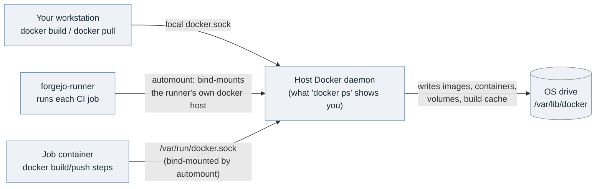

# Forgejo

[← Services Reference](../11-services-reference.md) | [Home](../../setup.md)

---

**Purpose:** Community-driven Git hosting — repos, issues, pull requests, CI/CD (Actions).
**Port:** `3002` (web), `2223` (SSH) | **Data:** `service_data/data/forgejo/` | **Requires:** Postgres | **Memory:** DB capped 384M in compose.yml; app: no hard limit set; measured idle ~96MB total (app 76 + db 20)

## Setup

```bash
cp services/forgejo/.env.example services/forgejo/.env
# set POSTGRES_PASSWORD (DOMAIN/ROOT_URL are derived from the root .env's DOMAIN, not set here)
uv run homeserver.py dev up forgejo
```

## Create an admin user

```bash
docker exec -it forgejo forgejo admin user create --username admin --password yourpassword --email admin@example.com --admin
```

## Connecting your git client

The web UI alone doesn't let you actually push code — a real git client needs to be pointed at this server first, over SSH or HTTPS. Confirmed against Forgejo's own current user documentation, not assumed from memory.

- **SSH (recommended for regular use):** generate a key locally if you don't already have one — `ssh-keygen -t ed25519 -C "you@example.com"` — then in Forgejo go to your avatar → **Settings → SSH / GPG Keys → Add Key** and paste the public key (`~/.ssh/id_ed25519.pub`). Because this stack publishes SSH on the non-standard port `2223` (not `22`), either clone with the full `ssh://` form that embeds the port — `ssh://git@forgejo.${DOMAIN}:2223/<owner>/<repo>.git` — or add an entry to `~/.ssh/config` once so plain `git@forgejo.${DOMAIN}:<owner>/<repo>.git` URLs work too:

  ```text
  Host forgejo.yourdomain.com
    Port 2223
  ```

- **HTTPS:** clone/push at `https://forgejo.${DOMAIN}/<owner>/<repo>.git` — git prompts for username/password on the first push (or a **personal access token** instead of a password, generated under Settings → Applications → Generate New Token, needed anyway if the account has 2FA enabled).
- **Verify the connection works** before relying on it: `ssh -T -p 2223 git@forgejo.${DOMAIN}` should return a Forgejo greeting (not a connection error) if the SSH key was added correctly.

## Using it day to day

Confirmed against Forgejo's own current user documentation, not assumed from memory.

- **Creating a repo:** top-right **+** → **New Repository** — pick owner, name, visibility, optionally a README/`.gitignore`/license (the license picker surfaces the `PREFERRED_LICENSES` IDs from `.env` first — see Notes below). Clone/push it using whichever connection method was set up above.
- **Issues:** each repo's **Issues** tab — title/description, labels, assignees, milestones. Reference or auto-close one from a commit message or PR description with `Fixes #12` / `Closes #12` (closes on merge).
- **Pull requests:** push a branch (or fork the repo) then **Pull Requests → New Pull Request** against the target branch. Reviewers can approve, request changes, or leave inline comments; merge strategy (merge commit / rebase / squash) is configurable per-repo under repo **Settings → Merge Options**.
- **Actions/CI:** once the optional runner (below) is up, any workflow committed to `.forgejo/workflows/*.yml` runs automatically on push/PR/etc. — same syntax as GitHub Actions, so an existing `runs-on: ubuntu-latest` workflow usually just works unmodified (see the `RUNNER_LABELS` note below for why). Runs and logs show up under the repo's own **Actions** tab.
- **Webhooks:** repo **Settings → Webhooks → Add Webhook** — pick a target type (Forgejo/Gitea, Slack, Discord, generic JSON, etc.), set the payload URL and optional secret, and choose which events fire it (push, PR, issue, release, ...). Useful for notifying something external without needing Actions/CI at all.

## Notes

- Image: `codeberg.org/forgejo/forgejo:16.0.3`
- Config env vars use the `FORGEJO__` prefix
- Setup wizard is skipped via `FORGEJO__security__INSTALL_LOCK=true`
- `FORGEJO__server__ROOT_URL` must be `https://forgejo.${DOMAIN}` (not `http`) since Cloudflare always terminates TLS
- SSH clone port is `2223` on the host → `22` in the container
- Forgejo bundles 776 SPDX license templates, covering GitHub's documented license chooser list. Apache License 2.0 (`Apache-2.0`), GNU GPL v3.0-only (`GPL-3.0-only`), and MIT (`MIT`) are pinned to the top of the picker via `PREFERRED_LICENSES`; change the comma-separated IDs in `.env` to reorder them. Use `GPL-3.0-or-later` instead if repositories should permit later GPL versions.

## Migrated: `forgejo-db` from `postgres:18.4` to `postgres:18.4-alpine`

Done as a trial of moving other services' Postgres containers to the smaller Alpine-based image (~150MB smaller than the Debian-based default) — forgejo was picked as the safe/low-stakes service to validate the process on before touching anything with real production data.

**Why this can't be a simple image-tag swap:** Postgres bakes the OS's collation library into the data directory at `initdb` time. Alpine uses musl libc, the default image uses glibc — switching the image tag on an *already-initialized* volume silently leaves indexes sorted under a collation version that no longer matches the running library, which can corrupt sorted/text indexes without any obvious error at switch time. This is a well-documented footgun (see [docker-library/postgres#327](https://github.com/docker-library/postgres/issues/327)); the only safe path is a **logical migration** (`pg_dump`/`pg_restore`) into a freshly-initialized cluster, never reusing the old volume's on-disk files directly.

**Process used** — `homeserver.py` has this built in as two commands, `dump` and `migrate` (originally validated manually on forgejo first; now the standard tool for any service):

```bash
# 1. Dump the running DB — pg_dump (custom format) + pg_dumpall --roles-only,
#    saved to service_data/db_dump/forgejo/<timestamp>/
uv run homeserver.py dev dump forgejo

# 2. Migrate — stops forgejo, swaps compose.yml's image tag to postgres:18.4-alpine
#    and renames the volume (forgejo-postgres -> forgejo-postgres-alpine, so the
#    new image gets a genuinely fresh initdb rather than touching the old volume),
#    starts ONLY the DB on that fresh volume, applies the roles dump, restores
#    the main dump, then brings the rest of the service back up
uv run homeserver.py dev migrate forgejo

# 3. Verify before trusting it — compare row/table counts against a baseline
#    taken before step 1, and check a real API response (not just a DB ping)
#    actually reflects the old data:
docker exec forgejo curl -s http://localhost:3000/api/v1/users/search

# 4. Only after verification passes — migrate prints the exact command:
docker volume rm forgejo_forgejo-postgres
```

Confirmed working: user count, table count, and a real `/api/v1/users/search` response all matched pre-migration state exactly; no migration/collation errors in `forgejo` app logs on first boot against the restored DB.

**Two gotchas found migrating other services this same way** (both now handled automatically by `dump`/`migrate`, not manual steps):

- **`pg_restore` erroring on `CREATE TYPE`/`CREATE TABLE` colliding with objects that already exist** — e.g. an image whose `docker-entrypoint-initdb.d/` script bootstraps its own schema (guacamole's `01-schema.sql`) before the restore ever runs. Fixed with `--clean --if-exists --no-owner` on the restore (safe here specifically because the target is always a container created fresh for this migration).
- **An app authenticating as a DB role other than `POSTGRES_USER`** — Nextcloud creates its own `oc_admin` role during initial setup and points `config.php` at it; a per-database `pg_dump` never captures that (roles are cluster-wide, not database-scoped), so the role silently didn't exist after restore and Nextcloud crash-looped on auth failure. Fixed by also running `pg_dumpall --roles-only` at dump time and applying it *before* the main restore — and deliberately keeping (not stripping) the restore's `GRANT` statements, since those are exactly what a secondary role like `oc_admin` needs on the restored tables. An earlier attempt added `--no-privileges` to sidestep the ordering problem instead of fixing the ordering — that broke `oc_admin`'s actual table access (login worked, every query returned `permission denied`) and has since been removed; see `docs/services/nextcloud.md` for the full incident.

**Not every Postgres image has an Alpine variant.** `migrate <service>` only auto-infers `-alpine` for the plain official `postgres:<tag>` image (no registry prefix). A custom/extended image (e.g. `immich`'s `ghcr.io/immich-app/postgres` with vectorchord/pgvector baked in) requires an explicit target: `migrate <service> --image <repo:tag>` — there's no way to know whether that specific fork even publishes an alpine (or any other) variant, so it's never guessed.

## Actions runner

1. In Forgejo, go to **Site Administration → Actions → Runners → Create new Runner** and copy the token.
2. Set `RUNNER_REGISTRATION_TOKEN` (and optionally `RUNNER_NAME`/`RUNNER_LABELS`) in `services/forgejo/.env`.
3. `uv run homeserver.py dev up forgejo`

The container registers itself on first boot (writing `${FORGEJO_RUNNER_DATA_ROOT}/.runner`) and then runs `forgejo-runner daemon`; on later boots it finds `.runner` already there and skips straight to `daemon`. If `RUNNER_REGISTRATION_TOKEN` is unset and no `.runner` file exists yet, the container logs an error and exits instead of crash-looping silently — check `docker logs forgejo-runner`.

The image's own default command (`forgejo-runner` with no subcommand) just prints help text and exits 0, which `restart: unless-stopped` loops forever without ever registering — this is why `compose.yml` overrides `command:` with the register-then-daemon script above instead of relying on the image default.

`RUNNER_LABELS` defaults to `docker`, `ubuntu-latest`, `ubuntu-24.04`, and `ubuntu-22.04`, all mapped to `catthehacker/ubuntu` images (`act-latest`/`act-24.04`/`act-22.04`) — the standard community image built to emulate GitHub's runner environment for act/Forgejo/Gitea. A workflow written for GitHub can be copied into `.forgejo/workflows/` unmodified and its `runs-on: ubuntu-latest` will already match, instead of everyone having to know to rewrite it as `runs-on: docker`. Plain `node:20-bookworm` (an earlier attempt at a lighter default) is not a safe substitute — its Node ABI is too old for `actions/checkout@v7`'s post-run cache step (`webidl.util.markAsUncloneable is not a function`), which fails the job.

**Labels only take effect at registration time.** Changing `RUNNER_LABELS` in `.env` after the runner has already registered has no effect until you force it to re-register: `docker exec forgejo-runner rm -f /data/.runner` then `uv run homeserver.py dev up forgejo`.

**`RUNNER_CAPACITY` controls how many jobs run at once — default `1`, strictly sequential.** Unlike labels, this takes effect on every restart, no re-registration needed. A workflow's matrix (e.g. `check`'s 4 Python versions) still only runs one leg at a time at the default; raising `RUNNER_CAPACITY` (e.g. to `4`, matching that matrix) lets independent jobs actually run in parallel, at the cost of proportionally more simultaneous CPU/memory/disk I/O.

**Tried and reverted: `RUNNER_CAPACITY=4` on Forgejo 16.0.3 — a real server-side bug, not a config problem.** Two matrix jobs finishing their status update in the same instant triggered `500 Internal Server Error` from Forgejo's own `UpdateTask` API endpoint (confirmed in `forgejo`'s own logs), instantly failing one of them — matches known upstream reports of Actions status-update races under concurrent runner load (e.g. [go-gitea/gitea#38001](https://github.com/go-gitea/gitea/issues/38001)). Separately, `check`'s `postgres`/`redis` services also collided on their fixed host ports (`5432`/`6379` published on `0.0.0.0`) when two jobs ran at once — a second, independent problem with any capacity above `1` given this workflow's current service port config. Neither is fixable from this repo's side; stayed at `RUNNER_CAPACITY=1` until Forgejo/Gitea fixes the race (and any workflow wanting real matrix parallelism would also need its services to use random/ephemeral host ports instead of fixed ones).

**A workflow step running `docker build`/`docker push` uses this host's real Docker, automounted into the job container.** `compose.yml` sets `container.docker_host: automount` — `forgejo-runner`'s own purpose-built setting that bind-mounts whatever Docker host the runner itself uses into every job container at `/var/run/docker.sock`. This is Forgejo's own documented "simplest" option (of three: automount, an isolated Docker-in-Docker sidecar, or LXC job containers) and the one actually proven reliable here after testing the alternative:



**Consequence: every CI job has root-equivalent access to this host's real Docker engine, and its image layers/build cache land on the OS drive.** Acceptable for a single trusted user's own repos on this instance — the alternative (an isolated Docker-in-Docker sidecar) was tried and reverted, documented below because the failure mode is worth knowing before re-attempting it.

### Tried and reverted: an isolated `forgejo-docker` Docker-in-Docker sidecar

The goal was to keep CI's Docker usage on a completely separate daemon and storage from this host's real Docker — a dedicated `docker:28-dind` container (`forgejo-docker`), with `container.docker_host: "tcp://forgejo-docker:2375"` pointing the runner at it instead of `automount`. It **partly worked**: `forgejo-runner` uses `docker_host` to create every job's own container regardless of which mode is set, and that part worked fine over TCP to `forgejo-docker` — `gate`/`check` jobs ran correctly. It broke specifically for a job that itself needs `docker build`/`push` (`publish`), for two separate, sequentially-discovered reasons:

1. **`forgejo-docker`'s storage must be on a native filesystem, not a FUSE-mounted one (NTFS/exFAT via `ntfs-3g` etc.)** — `overlay2` cannot mount on FUSE at all (dockerd's own log: `failed to mount overlay: invalid argument`), silently falling back to the `vfs` driver (full layer copies per container, no copy-on-write). Confirmed to cause CI jobs to hang indefinitely with zero visible activity rather than just run slow — the exact same runner pointed at the host's own Docker (`overlay2` on SSD) finished a job that had been stuck 6+ minutes in 3 seconds. Separately, a FUSE mount also reports every file as root-owned regardless of which UID wrote it, which broke `forgejo-runner`'s own `actions/checkout` cache (Git's "detected dubious ownership" check) the same way — this is *why* `FORGEJO_RUNNER_DATA_ROOT` below is a native-filesystem path outside `service_data/`, even though the sidecar itself is gone. If `service_data/` ever resolves to a FUSE mount again on this or another host, verify before pointing anything Docker-related at it:

   ```bash
   findmnt -T <path>   # fstype must NOT be fuseblk/ntfs/exfat
   ```

2. **Even once storage was fixed, `publish`'s own `docker build`/`push` still couldn't work against the sidecar.** Job containers created via `forgejo-docker` live entirely inside its own nested Docker engine; `forgejo-docker`'s hostname only resolves on the outer `homeserver` network, not from inside a job container (`DOCKER_HOST` pointed at it directly failed with `lookup forgejo-docker: no such host`). The standard fix for that — the same per-job Docker-in-Docker **service** mechanism this repo's own `check` jobs already use for `postgres`/`redis` — turned out to mean running `docker:28-dind` as a *third* nested level (host → `forgejo-docker` → job → service). It crashed on startup every time (confirmed via `forgejo-docker`'s own logs: the service container died within seconds of creation, before any build step could run) — a known fragility of deeply nested DinD, not a config mistake.

Given `publish` needs to actually work, and there was no remaining path to isolate it from the host without either breaking `check`'s existing service-container pattern (switching every job to `network_mode: host`) or relying on a proven-fragile triple-nested DinD, the whole runner reverted to `automount`. If revisiting this later, the more robust path for a genuinely isolated build/push step is likely a rootless builder that doesn't need privileged DinD at all (e.g. Kaniko), not another attempt at nested `docker:dind`.

See `docs/services/forgejo-examples/` for a matching CI workflow template and registry usage guide.

**Mirrored repos**: Forgejo Actions only triggers on `.forgejo/workflows/` (or `.gitea/workflows/` for compat) — never `.github/workflows/`. If the repo is a pull mirror (`is_mirror` in Forgejo's DB), you also can't add that file directly in Forgejo — mirror syncs force-reset tracked branches to match the upstream exactly (and prune anything else), so a locally-added file gets silently wiped at the next sync. Add `.forgejo/workflows/` to the *source* repo instead (e.g. on GitHub, if that's what's being mirrored) so it comes down with the next sync.

---

[← Services Reference](../11-services-reference.md) | [Home](../../setup.md)
