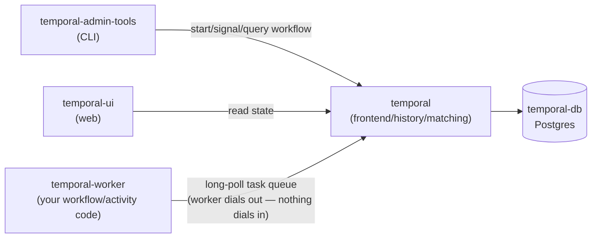

# Temporal

[← Services Reference](../11-services-reference.md) | [Home](../../setup.md)

---

**Purpose:** Durable execution engine for reliable distributed workflows — automatic retries, state persistence, and long-running processes that survive crashes.
**Port:** `8138` (host) → `8080` (container, `temporal-ui`) | **Data:** DB in a named volume; no `DATA_ROOT`-scoped app data | **Requires:** Postgres

## Setup

```bash
cp services/temporal/.env.example services/temporal/.env
# set POSTGRES_PASSWORD
mkdir -p service_data/data/temporal/worker
cp services/temporal/worker/*.py service_data/data/temporal/worker/   # optional — the starter workflows below
uv run homeserver.py dev up temporal
```

Open `https://temporal.<domain>/` (or `http://<host>:8138` in dev) — no login/setup wizard, the UI is open to anyone who can reach it (see Notes).

## Architecture — 7 containers; the deprecated `temporalio/auto-setup` image is no longer used

- `temporal-db` — Postgres, `DB=postgres12` driver (works for any Postgres 12+, not a version pin — this repo uses `postgres:18.4-alpine` like every other service here, not the `postgres:16` the official `.env` happens to pin)
- `temporal-schema-setup` — one-shot (`temporalio/admin-tools`, `restart: "no"`): runs `temporal-sql-tool create`/`setup-schema`/`update-schema` for both the main and visibility databases before the server starts. Replaces what the deprecated `temporalio/auto-setup` image used to do automatically at boot; idempotent (a no-op once already applied).
- `temporal` — `temporalio/server` image (not `auto-setup`): runs the actual server (frontend/history/matching/internal-worker services bundled in one process); expects the schema to already exist, which `temporal-schema-setup` provides
- `temporal-create-namespace` — one-shot (`temporalio/admin-tools`, `restart: "no"`): registers the `default`/`staging`/`production` namespaces (describe-then-create, idempotent) — replaces `auto-setup`'s automatic `default`-namespace registration, extended to three namespaces here
- `temporal-admin-tools` — the `tctl`/`temporal` CLI, for ad-hoc admin/debug commands (`docker exec -it temporal-admin-tools temporal ...`)
- `temporal-ui` — the web UI
- `temporal-worker` — **not part of Temporal's own official compose set.** See below.



The Worker never receives inbound connections — it polls the server's task queue and reports results back on the same outbound connection, which is why a Worker can crash and restart without Temporal needing to know its address.

## `temporal-worker` — a placeholder, not an official Temporal component

Unlike Airflow or Dagster, Temporal doesn't execute your workflow logic itself — a **Worker** is just a regular process (any language, official SDKs exist for Go/Java/Python/TypeScript/.NET/PHP/Ruby) that connects out to the Temporal frontend (`temporal:7233`) and runs whatever Workflow/Activity code you give it. There's no generic "Temporal worker" image to pull, because a worker with no code is meaningless — it's exactly as service-specific as Dagster's user-code container, and for the same reason gets the same one exception to this repo's image-only convention: `services/temporal/worker/Dockerfile` (`python:3.14-slim`, dependencies declared in `pyproject.toml` and installed via `uv sync --locked` against a committed `uv.lock`) installs dependencies only.

## Where your workflow code actually lives

`services/temporal/worker/*.py` is a **git-tracked template**, not what actually runs — the Dockerfile doesn't `COPY` them in. The container reads them from a bind mount: `service_data/data/temporal/worker/` (gitignored, your live copy). The Setup step above seeds it once from the template; after that the two are independent — edit freely in `service_data/`, it never touches git, and a `git pull` on this repo never overwrites your own workflow code. Same relationship as `.env.example`/`.env`, just for a whole directory instead of a few variables.

Changing the code only needs a restart, not a rebuild:

```bash
docker restart temporal-worker
```

`worker/` ships real, working workflows instead of a truly empty scaffold — each one demonstrates a different reason to reach for Temporal specifically, and each is runnable from `temporal-admin-tools` right now:

**`RunContainerWorkflow`** — resource-bounded execution. The worker has `${DOCKER_SOCKET}` mounted; its Activity calls the Docker SDK with explicit `mem_limit`/`cpu_count`, so a step's actual container never has an unbounded footprint on the host — the same pattern as Airflow's `DockerOperator`.

```bash
docker exec -it temporal-admin-tools temporal workflow start --address temporal:7233 \
  --task-queue homeserver \
  --type RunContainerWorkflow \
  --input '{"image": "alpine:3.21", "command": ["echo", "hello"], "mem_limit": "128m", "cpu_count": 1}'
```

**`RetryableActivityWorkflow`** — durability. `flaky_activity` fails on its first two calls and succeeds on the third; the Workflow code has zero retry logic written — Temporal's `RetryPolicy` handles it. Watch it retry live: start it, then open the workflow in the UI and look at its Event History (`ActivityTaskStarted`/`ActivityTaskFailed` pairs before the final success).

```bash
docker exec -it temporal-admin-tools temporal workflow start --address temporal:7233 \
  --task-queue homeserver \
  --type RetryableActivityWorkflow \
  --input '"demo-1"'
```

**`ApprovalWorkflow`** — durable state across arbitrarily long waits, resumed by an external Signal, inspectable at any time via a Query (Signals push data *in*; Queries read state back *out* without affecting execution — the two are normally taught as a pair). Start it (it'll sit paused), check on it, then approve it whenever:

```bash
docker exec -it temporal-admin-tools temporal workflow start --address temporal:7233 \
  --task-queue homeserver --type ApprovalWorkflow --workflow-id approval-demo-1
docker exec -it temporal-admin-tools temporal workflow query --address temporal:7233 \
  --workflow-id approval-demo-1 --type status        # -> "pending"
docker exec -it temporal-admin-tools temporal workflow signal --address temporal:7233 \
  --workflow-id approval-demo-1 --name approve
docker exec -it temporal-admin-tools temporal workflow query --address temporal:7233 \
  --workflow-id approval-demo-1 --type status        # -> "approved"
```

**`OrderFulfillmentSagaWorkflow`** — the Saga pattern, Temporal's actual flagship real-world use case: this exact shape (a distributed transaction across services, with compensation if a later step fails) is how Uber dispatches rides, Netflix handles billing retries, and Amazon does multi-warehouse fulfillment, at production scale. Reserve inventory → charge payment → create shipment, all plain sequential code — no separate saga-definition DSL, no hand-tracking of which steps already committed. `amount > 1000` simulates a declined payment so both outcomes are real:

```bash
docker exec -it temporal-admin-tools temporal workflow start --address temporal:7233 \
  --task-queue homeserver --type OrderFulfillmentSagaWorkflow --workflow-id saga-1 \
  --input '{"order_id": "ord-1", "amount": 50}'      # succeeds
docker exec -it temporal-admin-tools temporal workflow start --address temporal:7233 \
  --task-queue homeserver --type OrderFulfillmentSagaWorkflow --workflow-id saga-2 \
  --input '{"order_id": "ord-2", "amount": 5000}'    # declined -> compensates (releases inventory)
```

A real bug this caught during development, worth knowing about if you write your own compensation logic: the plain `raise RuntimeError(...)` a first version of `charge_payment_activity` used got retried by Temporal's *default* policy — indefinitely, since a declined payment looks identical to a transient fault unless you say otherwise. The workflow never reached its `except` block to compensate; it just sat retrying forever. Fix: raise `temporalio.exceptions.ApplicationError(..., non_retryable=True)` for genuine business-decision failures.

**`MaterializeDagsterAssetWorkflow`** — cross-service architecture. Calls Dagster's GraphQL API (`http://dagster-webserver:3000/graphql`) to launch a job, then polls until it finishes — durably: if this worker crashes mid-poll, Temporal replays and keeps waiting, no state lost, something a plain polling script can't do. `example_cross_service_pipeline` in `docs/services/airflow.md`'s Airflow DAGs starts this on a schedule — the capstone example: **Airflow schedules, Temporal durably orchestrates, Dagster materializes assets with lineage**, each tool doing the one thing it's actually best at. Verified working end to end (`docker exec airflow-scheduler airflow dags trigger example_cross_service_pipeline`, run completed with state `success`).

```bash
docker exec -it temporal-admin-tools temporal workflow start --address temporal:7233 \
  --task-queue homeserver --type MaterializeDagsterAssetWorkflow --input '"report_job"'
```

**`BatchProcessingWorkflow`** + **`GreetSourceWorkflow`** — composition via Child Workflows. The parent starts 3 children concurrently (`asyncio.gather` + `execute_child_workflow`), each with its own Workflow ID and Event History — one child's failure doesn't corrupt the parent's or another child's state. Compare against Airflow's `example_parallel_tasks.py`: similar fan-out shape at a glance, but each child here is independently durable and independently queryable, not just a step inside one shared DAG run.

```bash
docker exec -it temporal-admin-tools temporal workflow start --address temporal:7233 \
  --task-queue homeserver --type BatchProcessingWorkflow --workflow-id batch-demo-1 \
  --input '["source_a", "source_b", "source_c"]'
docker exec -it temporal-admin-tools temporal workflow list --address temporal:7233 \
  --query "WorkflowType='GreetSourceWorkflow'"   # each child has its own WorkflowId (batch-demo-1-child-*)
```

**`DelayedReminderWorkflow`** — a durable timer. `asyncio.sleep()` inside a workflow *is* the durable timer (Temporal's deterministic asyncio event loop makes the same stdlib call replay-safe) — it costs nothing while waiting, no polling loop, no cron job to keep alive, and it survives the worker going away entirely. Verified: started with a 20s delay, killed and restarted `temporal-worker` mid-sleep (`docker restart temporal-worker`), and it still fired at the original time — Temporal Server tracks the timer, not the worker process.

```bash
docker exec -it temporal-admin-tools temporal workflow start --address temporal:7233 \
  --task-queue homeserver --type DelayedReminderWorkflow --workflow-id reminder-demo-1 --input '20'
# try it yourself: docker restart temporal-worker partway through, then check the result still lands on time
docker exec -it temporal-admin-tools temporal workflow result --address temporal:7233 --workflow-id reminder-demo-1
```

**`ConfigurableCounterWorkflow`** — Update, the newer sibling of Signal for anything that needs a value back or needs the caller to know their change was actually accepted. A Signal is fire-and-forget; an Update blocks the caller until the handler returns, and a `@<name>.validator` can reject the change before it's even written to Event History — a negative `amount` never touches workflow state:

```bash
docker exec -it temporal-admin-tools temporal workflow start --address temporal:7233 \
  --task-queue homeserver --type ConfigurableCounterWorkflow --workflow-id counter-demo-1
docker exec -it temporal-admin-tools temporal workflow update execute --address temporal:7233 \
  --workflow-id counter-demo-1 --name increment --input '5'    # -> Result: 5
docker exec -it temporal-admin-tools temporal workflow update execute --address temporal:7233 \
  --workflow-id counter-demo-1 --name increment --input '-1'   # -> rejected by the validator, never applied
docker exec -it temporal-admin-tools temporal workflow signal --address temporal:7233 \
  --workflow-id counter-demo-1 --name finish
```

**`RecurringPollWorkflow`** — Continue-As-New, Temporal's answer to "this workflow runs forever" (a recurring poll loop, a counter that never stops) without its Event History growing without bound. Every 3 iterations it closes the current Run and starts a fresh one under the *same* Workflow ID — the WorkflowId stays constant across every Run, only the RunId changes. Verified: started it, watched the RunId change from `01a00701…` to `eda784d0…` under the unchanged WorkflowId `poll-demo-1` after the first cycle. It never stops on its own — terminate it when you're done watching:

```bash
docker exec -it temporal-admin-tools temporal workflow start --address temporal:7233 \
  --task-queue homeserver --type RecurringPollWorkflow --workflow-id poll-demo-1
docker exec -it temporal-admin-tools temporal workflow describe --address temporal:7233 \
  --workflow-id poll-demo-1   # RunId changes every 3 polls; WorkflowId doesn't
docker exec -it temporal-admin-tools temporal workflow terminate --address temporal:7233 \
  --workflow-id poll-demo-1
```

**`--start-delay`** — not a workflow, a client-side start option: delays when a Workflow Execution actually *begins*, without occupying a Schedule or spending any of the workflow's own history on a timer. Different from `DelayedReminderWorkflow` above (that delays partway *through* an already-running workflow) — this delays the start itself, the shape for "run this once, but not until later" without setting up recurring Scheduling. Verified: started `GreetSourceWorkflow` (which executes instantly once it starts) with a 15s delay — `ExecutionTime` read "9 seconds from now" while the workflow was still waiting, and the Run's total `StartTime`-to-`CloseTime` span was ~15s despite the workflow itself doing effectively no work.

```bash
docker exec -it temporal-admin-tools temporal workflow start --address temporal:7233 \
  --task-queue homeserver --type GreetSourceWorkflow --workflow-id start-delay-demo-1 \
  --input '"homeserver"' --start-delay 15s
docker exec -it temporal-admin-tools temporal workflow describe --address temporal:7233 \
  --workflow-id start-delay-demo-1   # ExecutionTime counts down before it actually starts
```

Keep the `activities.py`/`workflows.py` split if an activity needs a non-deterministic import (`docker`, `requests`, anything with I/O) — Temporal's sandbox rejects those inside a workflow's own module even when only the activity uses them (bit this exact setup during development; see the comment at the top of `activities.py`).

**Native scheduling**, independent of Airflow: any workflow can run on a cron without a separate scheduler service. Modern Temporal uses first-class Schedule objects (`temporal schedule create`), not the deprecated `cron_schedule` workflow-start parameter — `--cron`/`--calendar`/`--interval` are all supported. Verified with a real running Schedule (`--interval 1m` against `GreetSourceWorkflow`, so it was actually observable within a couple minutes instead of waiting for a real cron tick): it auto-started a new Workflow Execution every 60 seconds, each with its own timestamped Workflow ID (`greet-scheduled-2026-08-15T21:27:00Z`, `...T21:28:00Z`), both completed — then paused (not deleted) so `schedule describe` still shows the evidence (`ActionCounts: {"Total":2,...}`) without it running forever:

```bash
docker exec -it temporal-admin-tools temporal schedule create --address temporal:7233 \
  --schedule-id daily-retry-demo --cron "0 6 * * *" \
  --workflow-id daily-run --task-queue homeserver --type RetryableActivityWorkflow --input '"scheduled"'
docker exec -it temporal-admin-tools temporal schedule describe --address temporal:7233 --schedule-id daily-retry-demo
docker exec -it temporal-admin-tools temporal schedule toggle --address temporal:7233 --schedule-id daily-retry-demo --pause --reason "not needed yet"
```

**Batch operations** — acting on many Workflow Executions at once via a search query, instead of one Workflow ID at a time. Tracked as its own job (`temporal batch list`/`describe`), separate from the workflows it acts on. Verified: started 3 `ApprovalWorkflow` instances (`approval-batch-1/2/3`, each `pending`), then a single command signaled all three simultaneously —

```bash
docker exec -it temporal-admin-tools temporal workflow signal --address temporal:7233 \
  --query "WorkflowType='ApprovalWorkflow' AND WorkflowId STARTS_WITH 'approval-batch-' AND ExecutionStatus='Running'" \
  --name approve --reason "batch approval demo"
```

— `temporal batch describe --job-id <id>` showed `CompletedCount: 3/3, FailureCount: 0/3`, and all three workflows independently confirmed `"approved"` via query immediately after, then ran to completion. The same `--query` mechanism works for `workflow cancel`/`workflow terminate` — the real use case is something like "cancel every `Running` workflow of a type that turned out to have a bug," across however many are currently in flight, in one command instead of a loop.

## Namespaces — the isolation boundary, not the task queue name

A **Namespace** is Temporal's top-level unit of isolation: Workflow ID uniqueness, task queue scope, and visibility (search) are all namespace-scoped, even though every namespace here is served by the same cluster. Two namespaces can each have a task queue literally named `homeserver` and a workflow literally named `namespace-demo` running at the same time, with zero collision or shared state between them — same idea as a Kubernetes namespace or a DB schema, one deployment, cleanly separated tenants inside it.

This stack registers three: `default`, `staging`, `production` (`temporal-create-namespace` in `compose.yml`, idempotent — a no-op on every start after the first). `temporal-worker` runs one `Worker` loop per namespace, concurrently, in the same process (`worker.py`'s `NAMESPACES` list + `asyncio.gather`) — all three poll a task queue named `homeserver`, and never see each other's work. Every CLI example elsewhere in this doc implicitly targets `default` (Temporal assumes it when `--namespace` isn't passed); add `--namespace staging`/`--namespace production` to run the exact same commands against an isolated environment.

Verified: started the identical Workflow ID (`namespace-demo`, type `GreetSourceWorkflow`) in all three namespaces with a different input each —

```bash
for ns in default staging production; do
  docker exec temporal-admin-tools temporal workflow start --address temporal:7233 \
    --namespace "$ns" --task-queue homeserver --type GreetSourceWorkflow \
    --workflow-id namespace-demo --input "\"hello-from-$ns\""
done
```

— all three accepted with no ID collision, and each completed with its own distinct, correct result (`"processed hello-from-default"`, `"processed hello-from-staging"`, `"processed hello-from-production"`), proving genuinely independent execution, not just non-interference.

This is also the real, common reason to reach for multiple namespaces on one cluster in the first place: environment isolation (dev/staging/production sharing one Temporal deployment instead of standing up three) — and it's the exact boundary [Nexus](#notes) is built to bridge *between*, for when two namespaces need to call into each other rather than stay fully separate.

**A more concrete version of that, using a real workflow instead of the toy greeting one**: test a change to `OrderFulfillmentSagaWorkflow` in `staging` first, without it ever touching `production`.

```bash
docker exec temporal-admin-tools temporal workflow start --address temporal:7233 \
  --namespace staging --task-queue homeserver --type OrderFulfillmentSagaWorkflow \
  --workflow-id saga-staging-test --input '{"order_id": "test-1", "amount": 50}'
```

Verified: this completed normally in `staging` (`"Order test-1 fulfilled: ..."`), and querying `production` for that same workflow type immediately after (`temporal workflow list --namespace production --query "WorkflowType='OrderFulfillmentSagaWorkflow'"`) returns **zero results** — not filtered out, genuinely never existed there. Once you trust the change, the identical command with `--namespace production` (and a real `--workflow-id`, not a `-test` one) is how it actually goes live — same workflow code, same task queue name, same worker process even, just a different namespace on the client call.

## Resource caps — deliberately conservative starting points

Every container here has a `deploy.resources.limits.memory` cap (`temporal-db` 512M, `temporal` 768M, `temporal-ui` 256M, `temporal-admin-tools` 128M, `temporal-worker` 256M) — small enough that this doesn't crowd out the rest of the stack on a shared host, at the cost of being tight under real production workflow volume. If `temporal` (the server) gets OOM-killed under load (`docker inspect temporal --format '{{.State.OOMKilled}}'`), raise its cap first — it's the one actually doing frontend/history/matching work; the others are much less likely to need it.

## Notes

- **No built-in auth on the UI or the `temporal-worker`/`temporal-admin-tools` connection to the server** — anyone who can reach `temporal.<domain>` can see and operate on every workflow. Fine for a single-user homelab behind Cloudflare Tunnel; if this ever needs to be shared, put it behind Authentik (this stack already has it) rather than relying on Temporal's own (enterprise-only) auth.
- `DYNAMIC_CONFIG_FILE_PATH` points at `dynamicconfig/development-sql.yaml` — Temporal's own official "development" config (`system.forceSearchAttributesCacheRefreshOnRead: true`), fine for a homelab's workflow volume; their docs explicitly say not to use it in a real production deployment (immediate-consistency search-attribute reads have a real perf cost at scale).
- Elasticsearch is **not** deployed — the official compose set has an Elasticsearch variant for advanced visibility queries; this uses the plain SQL (Postgres) visibility store instead, which covers normal workflow search/filtering fine and is one less container to run.
- **Nexus (cross-namespace/cross-cloud workflow calls, GA) is not set up here** — worth knowing it exists, not something this stack currently uses. Nexus lets one Temporal namespace call into Workflows/Signals/Updates/Queries running in a *different* namespace (even a different cluster/cloud) through a versioned API contract, instead of hand-rolling a webhook or a REST call between them — the same problem `MaterializeDagsterAssetWorkflow` solves today by calling Dagster's GraphQL API directly, generalized to Temporal-to-Temporal. Not added here because this deployment only runs a single namespace (`default`) — Nexus's whole value is connecting *separate* namespaces owned by separate teams/services, which doesn't apply until there's a second namespace worth isolating. If that ever changes: `temporal operator nexus endpoint create`, then a Nexus service/operation defined in the calling workflow's worker — see [Temporal's Nexus docs](https://docs.temporal.io/nexus).

---

[← Services Reference](../11-services-reference.md) | [Home](../../setup.md)
