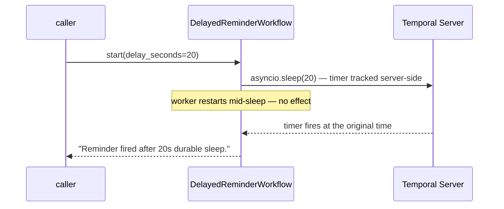

# DelayedReminderWorkflow

[← Temporal](temporal.md) | [Home](../../../setup.md)

---

A durable timer. `asyncio.sleep()` inside a workflow *is* the durable timer (Temporal's deterministic asyncio event loop makes the same stdlib call replay-safe) — it costs nothing while waiting, no polling loop, no cron job to keep alive, and it survives the worker going away entirely.

📍 `services/temporal/worker/workflows.py:159`



**Verified:** started with a 20s delay, killed and restarted `temporal-worker` mid-sleep (`docker restart temporal-worker`), and it still fired at the original time — Temporal Server tracks the timer, not the worker process.

## Try it

```bash
docker exec -it temporal-admin-tools temporal workflow start --address temporal:7233 \
  --task-queue homeserver --type DelayedReminderWorkflow --workflow-id reminder-demo-1 --input '20'
# try it yourself: docker restart temporal-worker partway through, then check the result still lands on time
docker exec -it temporal-admin-tools temporal workflow result --address temporal:7233 --workflow-id reminder-demo-1
```

---

[← Temporal](temporal.md) | [Home](../../../setup.md)
