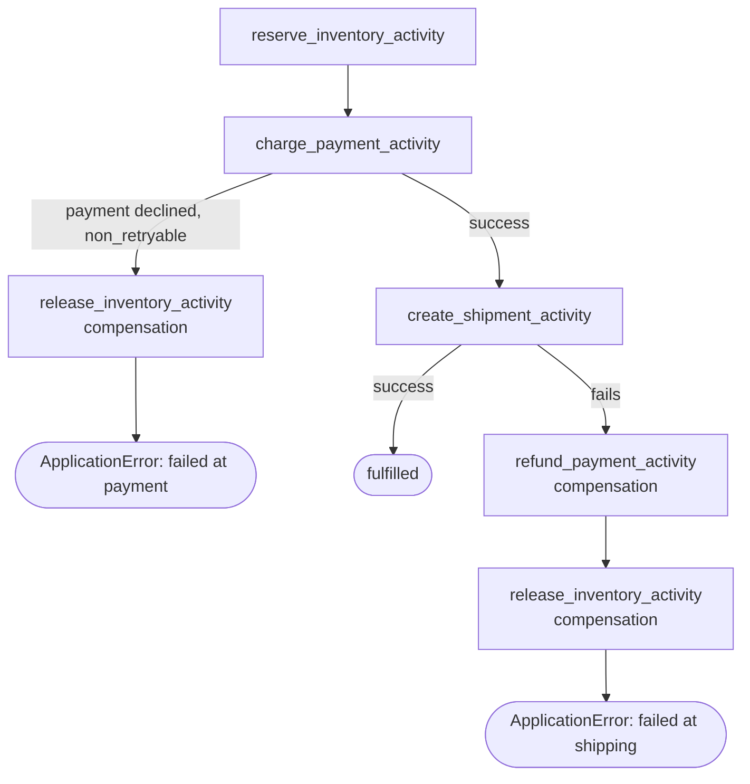

# OrderFulfillmentSagaWorkflow

[← Temporal](temporal.md) | [Home](../../../setup.md)

---

The Saga pattern, Temporal's actual flagship real-world use case: this exact shape (a distributed transaction across services, with compensation if a later step fails) is how Uber dispatches rides, Netflix handles billing retries, and Amazon does multi-warehouse fulfillment, at production scale. Reserve inventory → charge payment → create shipment, all plain sequential code — no separate saga-definition DSL, no hand-tracking of which steps already committed. Neither Airflow nor Dagster has a built-in equivalent — see the [feature-parity table](../../12-orchestration.md).

📍 `services/temporal/worker/workflows.py:260`



`amount > 1000` simulates a declined payment so both outcomes are real, runnable paths, not just described.

A real bug this caught during development, worth knowing about if you write your own compensation logic: the plain `raise RuntimeError(...)` a first version of `charge_payment_activity` used got retried by Temporal's *default* policy — indefinitely, since a declined payment looks identical to a transient fault unless you say otherwise. The workflow never reached its `except` block to compensate; it just sat retrying forever. Fix: raise `temporalio.exceptions.ApplicationError(..., non_retryable=True)` for genuine business-decision failures.

## Try it

```bash
docker exec -it temporal-admin-tools temporal workflow start --address temporal:7233 \
  --task-queue homeserver --type OrderFulfillmentSagaWorkflow --workflow-id saga-1 \
  --input '{"order_id": "ord-1", "amount": 50}'      # succeeds
docker exec -it temporal-admin-tools temporal workflow start --address temporal:7233 \
  --task-queue homeserver --type OrderFulfillmentSagaWorkflow --workflow-id saga-2 \
  --input '{"order_id": "ord-2", "amount": 5000}'    # declined -> compensates (releases inventory)
```

---

[← Temporal](temporal.md) | [Home](../../../setup.md)
