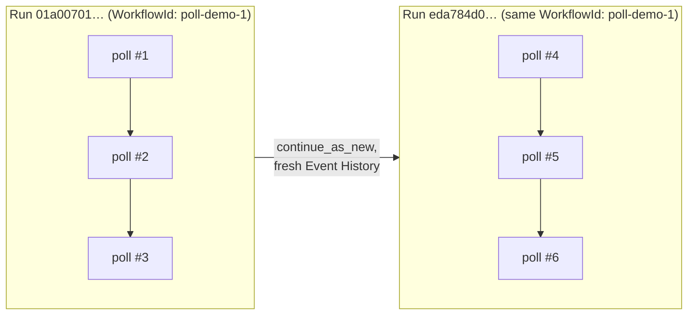

# RecurringPollWorkflow

[← Temporal](temporal.md) | [Home](../../../setup.md)

---

Continue-As-New, Temporal's answer to "this workflow runs forever" (a recurring poll loop, a counter that never stops) without its Event History growing without bound. Every 3 iterations it closes the current Run and starts a fresh one under the *same* Workflow ID — the WorkflowId stays constant across every Run, only the RunId changes.

📍 `services/temporal/worker/workflows.py:226`



**Verified:** started it, watched the RunId change from `01a00701…` to `eda784d0…` under the unchanged WorkflowId `poll-demo-1` after the first cycle. It never stops on its own — terminate it when you're done watching.

## Try it

```bash
docker exec -it temporal-admin-tools temporal workflow start --address temporal:7233 \
  --task-queue homeserver --type RecurringPollWorkflow --workflow-id poll-demo-1
docker exec -it temporal-admin-tools temporal workflow describe --address temporal:7233 \
  --workflow-id poll-demo-1   # RunId changes every 3 polls; WorkflowId doesn't
docker exec -it temporal-admin-tools temporal workflow terminate --address temporal:7233 \
  --workflow-id poll-demo-1
```

---

[← Temporal](temporal.md) | [Home](../../../setup.md)
