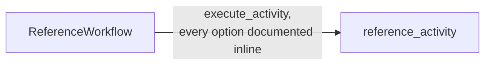

# ReferenceWorkflow

[← Temporal](temporal.md) | [Home](../../../setup.md)

---

Reference, not a pattern demo like the workflows above: every `workflow.execute_activity()` and `RetryPolicy` option in one place, each shown at its real default with a one-line explanation (a checklist to copy from, not a live example of any one pattern). `@activity.defn`'s own (shorter) option list is documented the same way right above `reference_activity` in `activities.py`, and `Worker.__init__`'s process-wide options (concurrency limits, poller behavior, versioning...) are documented as a comment in `worker.py` next to this repo's one `Worker(...)` construction — those apply to the whole worker process, not to any single workflow.

📍 `services/temporal/worker/workflows.py:320` (workflow) / `services/temporal/worker/activities.py:149` (`reference_activity`) / `services/temporal/worker/worker.py:80` (`Worker(...)` options)



**Verified end to end.**

## Try it

```bash
docker exec temporal-admin-tools temporal workflow start --address temporal:7233 \
  --task-queue homeserver --type ReferenceWorkflow --workflow-id reference-demo-1
docker exec temporal-admin-tools temporal workflow result --address temporal:7233 --workflow-id reference-demo-1
# -> Result: "reference_activity completed"
```

---

[← Temporal](temporal.md) | [Home](../../../setup.md)
