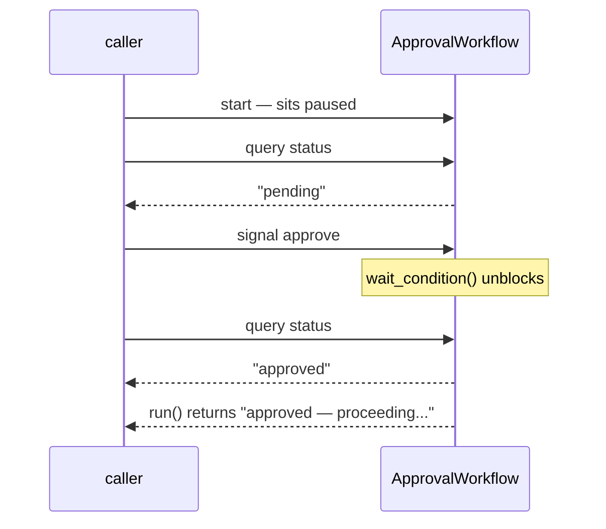

# ApprovalWorkflow

[← Temporal](../temporal.md) | [Home](../../../../setup.md)

---

Durable state across arbitrarily long waits, resumed by an external Signal, inspectable at any time via a Query (Signals push data *in*; Queries read state back *out* without affecting execution — the two are normally taught as a pair). The direct parallel to Airflow's built-in [`example_human_in_the_loop`](../../airflow/examples/example_human_in_the_loop.md) — same underlying idea, different mechanism: this is hand-written workflow code waiting on a Signal, Airflow's HITL is a single operator that does the same job with no Signal-handling code.

📍 `services/temporal/worker/workflows.py:63`



## Try it

```bash
docker exec -it temporal-admin-tools temporal workflow start --address temporal:7233 \
  --task-queue homeserver --type ApprovalWorkflow --workflow-id approval-demo-1
docker exec -it temporal-admin-tools temporal workflow query --address temporal:7233 \
  --workflow-id approval-demo-1 --type status        # -> "pending"
docker exec -it temporal-admin-tools temporal workflow signal --address temporal:7233 \
  --workflow-id approval-demo-1 --name approve
docker exec -it temporal-admin-tools temporal workflow query --address temporal:7233 \
  --workflow-id approval-demo-1 --type status        # -> "approved"
```

---

[← Temporal](../temporal.md) | [Home](../../../../setup.md)
