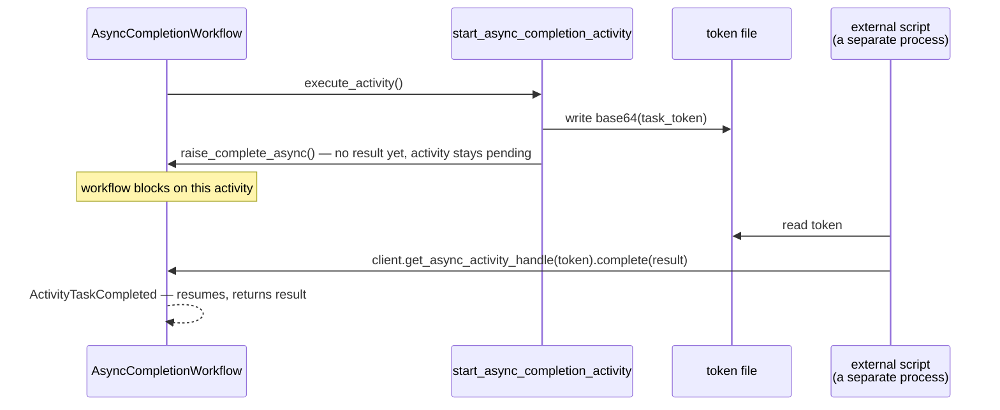

# AsyncCompletionWorkflow

[← Temporal](../temporal.md) | [Home](../../../../setup.md)

---

Strength: handing an Activity off to a completely separate, external process — a ticketing system, a human's approval queue, a webhook callback — that finishes it later using a token, not by the workflow polling or waiting on a Signal. Contrast with [`ApprovalWorkflow`](ApprovalWorkflow.md)'s Signal-based human-in-the-loop: here it's the *Activity itself* that stays pending, completed by whoever holds the token, not the workflow. `start_async_completion_activity` writes its own token to a file and tells Temporal not to expect a result from this process — a file standing in for a real external system.

**Real-world problem:** your process kicks off work in a system that has no way to call your code back directly — a support ticket that gets resolved whenever an agent gets to it, a fraud review queue, a partner's webhook that fires on their own schedule. You need to durably wait for "someone else, eventually" without polling in a loop or coupling your workflow to how that other system happens to notify you.

📍 `services/temporal/worker/workflows.py:430` (workflow) / `services/temporal/worker/activities.py:212` (`start_async_completion_activity`)



**A real gotcha hit building this**, worth knowing if you build your own: the activity's declared return type (`-> str`) must match whatever the external completer passes to `handle.complete(...)`. Completing with a mismatched type doesn't fail cleanly — it corrupts every future replay of this workflow (`WorkflowTaskFailed`, retried forever), since Temporal deserializes against the *original* activity's type signature on each replay, not the completer's. First version declared `-> None` and completed with a string; fixed by matching the type.

**Verified live:** the workflow genuinely blocked (`ActivityTaskScheduled`/`Started`, no `Completed`) until a separate `python3` process, holding only the token read from the file, called `handle.complete(...)` — the workflow then resumed and returned that exact external value.

## Try it

```bash
docker exec -it temporal-admin-tools temporal workflow start --address temporal:7233 \
  --task-queue homeserver --type AsyncCompletionWorkflow --workflow-id async-completion-demo-1

# from a separate process, holding only the token:
docker exec temporal-worker python3 -c "
import asyncio, base64
from temporalio.client import Client

async def main():
    client = await Client.connect('temporal:7233', namespace='default')
    with open('/tmp/.async_completion_task_token') as f:
        token = base64.b64decode(f.read())
    handle = client.get_async_activity_handle(task_token=token)
    await handle.complete('completed externally, by a process holding only the token')

asyncio.run(main())
"
docker exec -it temporal-admin-tools temporal workflow result --address temporal:7233 --workflow-id async-completion-demo-1
```

---

[← Temporal](../temporal.md) | [Home](../../../../setup.md)
