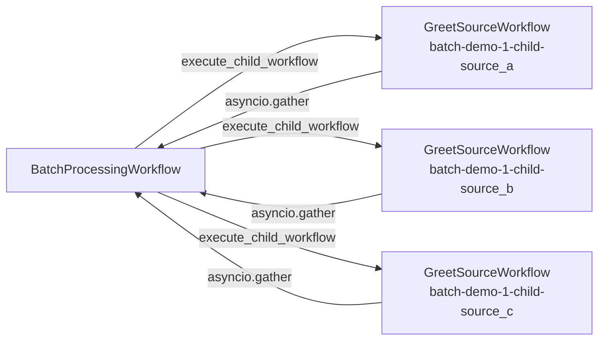

# BatchProcessingWorkflow / GreetSourceWorkflow

[← Temporal](../temporal.md) | [Home](../../../../setup.md)

---

Composition via Child Workflows. `BatchProcessingWorkflow` starts 3 `GreetSourceWorkflow` children concurrently (`asyncio.gather` + `execute_child_workflow`), each with its own Workflow ID and Event History — one child's failure doesn't corrupt the parent's or another child's state. Compare against Airflow's [`example_parallel_tasks`](../../airflow/examples/example_parallel_tasks.md): similar fan-out shape at a glance, but each child here is independently durable and independently queryable, not just a step inside one shared DAG run.

📍 `services/temporal/worker/workflows.py:119` (`GreetSourceWorkflow`) / `:130` (`BatchProcessingWorkflow`)



## Try it

```bash
docker exec -it temporal-admin-tools temporal workflow start --address temporal:7233 \
  --task-queue homeserver --type BatchProcessingWorkflow --workflow-id batch-demo-1 \
  --input '["source_a", "source_b", "source_c"]'
docker exec -it temporal-admin-tools temporal workflow list --address temporal:7233 \
  --query "WorkflowType='GreetSourceWorkflow'"   # each child has its own WorkflowId (batch-demo-1-child-*)
```

`GreetSourceWorkflow` also demonstrates `--start-delay` on its own — see [`temporal.md`](../temporal.md)'s `--start-delay` section for delaying a Workflow Execution's actual start.

---

[← Temporal](../temporal.md) | [Home](../../../../setup.md)
