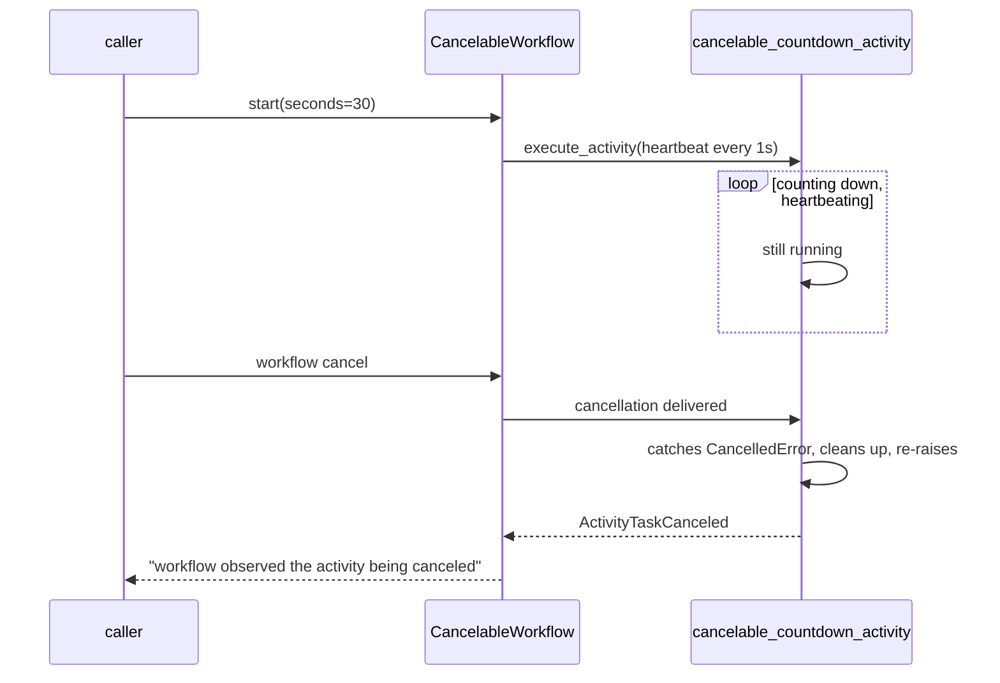

# CancelableWorkflow

[← Temporal](../temporal.md) | [Home](../../../../setup.md)

---

Strength: propagating a cancellation into a running Activity, not just the Workflow around it. `cancelable_countdown_activity` heartbeats every second specifically so this works — an activity that never heartbeats can't be told to stop mid-flight, Temporal has no way to interrupt code it isn't polling. `cancellation_type=WAIT_CANCELLATION_COMPLETED` means this workflow call doesn't return until the activity has actually acknowledged the cancellation (run its cleanup and re-raised), not just until the cancel request was sent.

**Real-world problem:** a user clicks "cancel" on a long-running export or video render. Without real cancellation reaching the actual work, the job either keeps burning CPU/API quota in the background forever, or the UI just stops showing it with no way to genuinely stop it or clean up whatever it already started.

📍 `services/temporal/worker/workflows.py:405` (workflow) / `services/temporal/worker/activities.py:189` (`cancelable_countdown_activity`)



**Verified live** via the real Event History (`temporal workflow show`): `ActivityTaskCancelRequested` → `ActivityTaskCanceled`, not an immediate abandonment — genuine cancellation delivery and acknowledgment, matching what `WAIT_CANCELLATION_COMPLETED` promises.

## Try it

```bash
docker exec -it temporal-admin-tools temporal workflow start --address temporal:7233 \
  --task-queue homeserver --type CancelableWorkflow --workflow-id cancel-demo-1 --input '30'
docker exec -it temporal-admin-tools temporal workflow cancel --address temporal:7233 --workflow-id cancel-demo-1
docker exec -it temporal-admin-tools temporal workflow show --address temporal:7233 --workflow-id cancel-demo-1
```

---

[← Temporal](../temporal.md) | [Home](../../../../setup.md)
