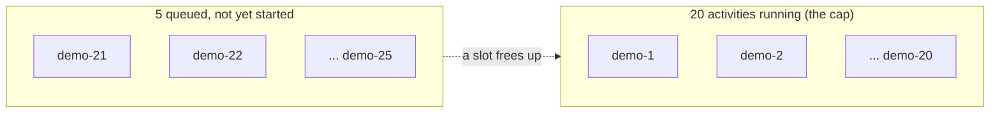

# ConcurrencyLimitedWorkflow

[← Temporal](../temporal.md) | [Home](../../../../setup.md)

---

Demonstrates `Worker(max_concurrent_activities=20)` (see `worker.py`) actually capping throughput — a process-wide setting, not a per-workflow one, so this workflow is just a thin wrapper around `slow_activity_for_concurrency_demo` to make the cap observable. The direct Temporal analog of Airflow's [`example_max_active_runs`](../../airflow/examples/example_max_active_runs.md) (`max_active_runs=1`) and Dagster's `pool=`, except this caps activity *execution* worker-wide, not runs of one specific workflow — see the [feature-parity table](../../../12-orchestration.md).

`max_concurrent_activities=20` isn't just a demo value — it's a real, permanent cap in `worker.py` now. The SDK default is unbounded (effectively however many the server hands out), which for this repo meant e.g. `RunContainerWorkflow` could launch an unbounded number of Docker containers at once if enough workflows started together.

📍 `services/temporal/worker/workflows.py:451` (workflow) / `services/temporal/worker/worker.py:128` (`max_concurrent_activities=20`)



**Verified live:** started 25 `ConcurrencyLimitedWorkflow` executions at once (8s activity each). `temporal workflow show` on each confirmed workflows 1–20 reached `ActivityTaskStarted`; workflows 21–25 sat at `ActivityTaskScheduled` — queued behind the cap, not run in parallel, exactly as `max_concurrent_activities=20` promises.

## Try it

```bash
for i in $(seq 1 25); do
  docker exec temporal-admin-tools temporal workflow start --address temporal:7233 \
    --task-queue homeserver --type ConcurrencyLimitedWorkflow --workflow-id "concurrency-demo-$i" --input '8'
done
docker exec temporal-admin-tools temporal workflow show --address temporal:7233 --workflow-id concurrency-demo-25
# ActivityTaskScheduled but no ActivityTaskStarted yet = queued behind the cap
```

---

[← Temporal](../temporal.md) | [Home](../../../../setup.md)
