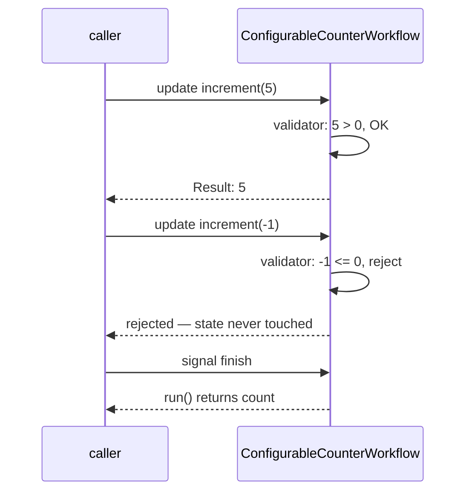

# ConfigurableCounterWorkflow

[← Temporal](../temporal.md) | [Home](../../../../setup.md)

---

Update, the newer sibling of Signal for anything that needs a value back or needs the caller to know their change was actually accepted. A Signal is fire-and-forget; an Update blocks the caller until the handler returns, and a `@<name>.validator` can reject the change before it's even written to Event History — a negative `amount` never touches workflow state.

📍 `services/temporal/worker/workflows.py:179`



## Try it

```bash
docker exec -it temporal-admin-tools temporal workflow start --address temporal:7233 \
  --task-queue homeserver --type ConfigurableCounterWorkflow --workflow-id counter-demo-1
docker exec -it temporal-admin-tools temporal workflow update execute --address temporal:7233 \
  --workflow-id counter-demo-1 --name increment --input '5'    # -> Result: 5
docker exec -it temporal-admin-tools temporal workflow update execute --address temporal:7233 \
  --workflow-id counter-demo-1 --name increment --input '-1'   # -> rejected by the validator, never applied
docker exec -it temporal-admin-tools temporal workflow signal --address temporal:7233 \
  --workflow-id counter-demo-1 --name finish
```

---

[← Temporal](../temporal.md) | [Home](../../../../setup.md)
