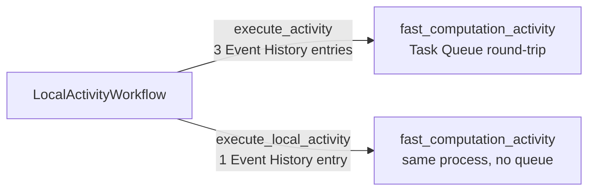

# LocalActivityWorkflow

[← Temporal](../temporal.md) | [Home](../../../../setup.md)

---

Strength: cost. `execute_local_activity()` runs `fast_computation_activity` directly inside this Workflow Worker process — no Activity Task Queue round-trip, no separate Activity Worker slot consumed, far fewer Event History entries than the regular `execute_activity()` call right next to it. The tradeoff, not glossed over: a local activity is bound by the *Workflow Task* timeout (a few seconds by default) rather than its own independent timeout, and has weaker retry/cancellation guarantees — reach for it only for genuinely short, cheap calls, never for anything that might run long or that other workers need to be able to pick up.

📍 `services/temporal/worker/workflows.py:381`



**Verified live** via `temporal workflow show`: the regular call produced `ActivityTaskScheduled` → `ActivityTaskStarted` → `ActivityTaskCompleted` (3 events); the local call collapsed to a single `MarkerRecorded` event. Both returned the identical result (`25` for input `5`).

## Try it

```bash
docker exec -it temporal-admin-tools temporal workflow start --address temporal:7233 \
  --task-queue homeserver --type LocalActivityWorkflow --workflow-id local-activity-demo-1 --input '5'
docker exec -it temporal-admin-tools temporal workflow show --address temporal:7233 --workflow-id local-activity-demo-1
```

---

[← Temporal](../temporal.md) | [Home](../../../../setup.md)
