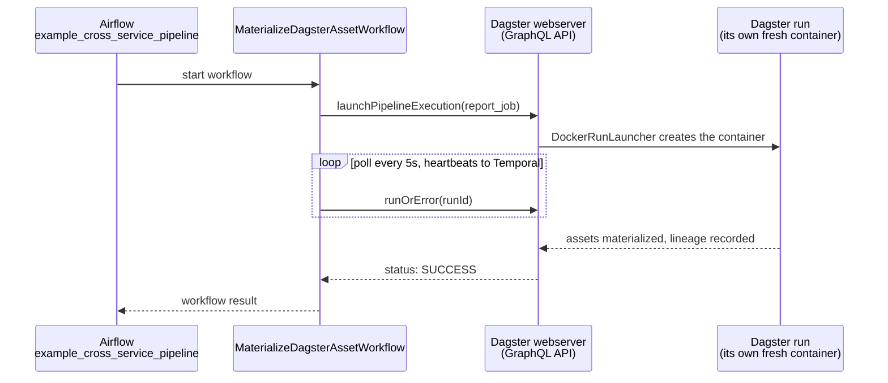

# MaterializeDagsterAssetWorkflow

[← Temporal](../temporal.md) | [Home](../../../../setup.md)

---

Cross-service architecture. Calls Dagster's GraphQL API (`http://dagster-webserver:3000/graphql`) to launch a job, then polls until it finishes — durably: if this worker crashes mid-poll, Temporal replays and keeps waiting, no state lost, something a plain polling script can't do. Airflow's [`example_cross_service_pipeline`](../../airflow/examples/example_cross_service_pipeline.md) starts this on a schedule — the capstone example: **Airflow schedules, Temporal durably orchestrates, Dagster materializes assets with lineage**, each tool doing the one thing it's actually best at.

**Real-world problem:** a nightly pipeline needs to kick off a job in a completely different system and reliably wait for it to finish before moving on — but a plain HTTP call plus a polling loop dies with the calling process, loses track of how long it's been waiting, and has no retry/backoff if the target system is briefly unreachable.

📍 `services/temporal/worker/workflows.py:99` (workflow) / `services/temporal/worker/activities.py:56` (`materialize_dagster_asset_activity`)



**Verified working end to end** (`docker exec airflow-scheduler airflow dags trigger example_cross_service_pipeline`, run completed with state `success`). Full trace also in [`docs/12-orchestration.md`](../../../12-orchestration.md)'s "They compose" section.

## Try it

```bash
docker exec -it temporal-admin-tools temporal workflow start --address temporal:7233 \
  --task-queue homeserver --type MaterializeDagsterAssetWorkflow --input '"report_job"'
```

---

[← Temporal](../temporal.md) | [Home](../../../../setup.md)
