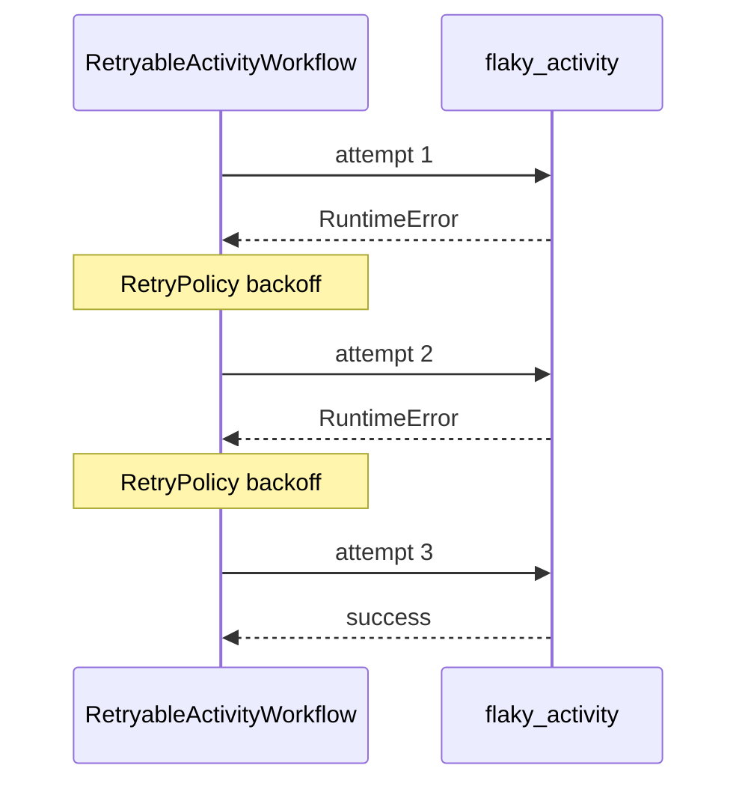

# RetryableActivityWorkflow

[← Temporal](../temporal.md) | [Home](../../../../setup.md)

---

Durability. `flaky_activity` fails on its first two calls and succeeds on the third; the Workflow code has zero retry logic written — Temporal's `RetryPolicy` handles it. The same "fails twice, succeeds on the third attempt" shape as Airflow's [`example_scheduled_with_retries`](../../airflow/examples/example_scheduled_with_retries.md) and Dagster's [`flaky_retry_asset`](../../dagster/examples/flaky_retry_asset.md) — see the [feature-parity table](../../../12-orchestration.md) for all three side by side.

📍 `services/temporal/worker/workflows.py:42` (workflow) / `services/temporal/worker/activities.py:46` (`flaky_activity`)



Watch it retry live: start it, then open the workflow in the UI and look at its Event History (`ActivityTaskStarted`/`ActivityTaskFailed` pairs before the final success).

## Try it

```bash
docker exec -it temporal-admin-tools temporal workflow start --address temporal:7233 \
  --task-queue homeserver \
  --type RetryableActivityWorkflow \
  --input '"demo-1"'
```

---

[← Temporal](../temporal.md) | [Home](../../../../setup.md)
