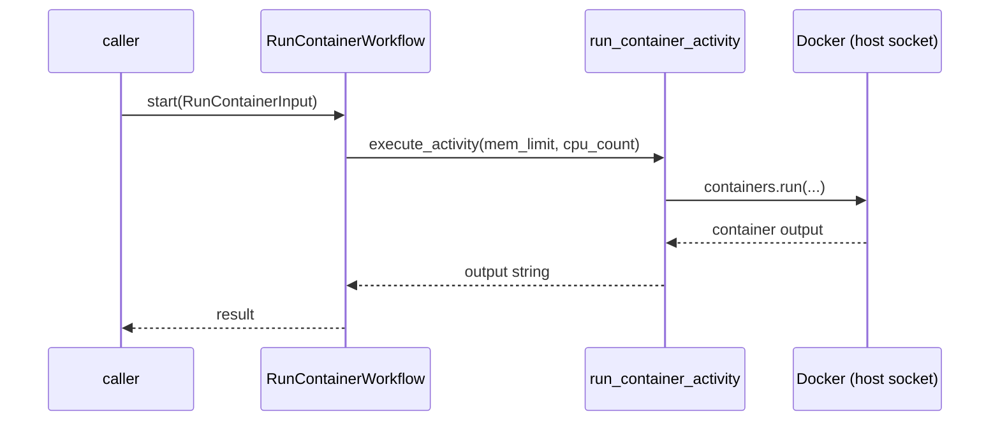

# RunContainerWorkflow

[← Temporal](../temporal.md) | [Home](../../../../setup.md)

---

Resource-bounded execution. The worker has `${DOCKER_SOCKET}` mounted; its Activity calls the Docker SDK with explicit `mem_limit`/`cpu_count`, so a step's actual container never has an unbounded footprint on the host — the same pattern as Airflow's [`example_docker_operator`](../../airflow/examples/example_docker_operator.md).

**Real-world problem:** a workflow step needs to run arbitrary or third-party code — a user-submitted script, a one-off conversion tool — that you don't fully trust to behave. Running it directly inside the worker process risks it hogging all the host's memory/CPU or crashing the worker entirely if it misbehaves, taking every other workflow on that worker down with it.

📍 `services/temporal/worker/workflows.py:28` (workflow) / `services/temporal/worker/activities.py:24` (`run_container_activity`)



## Try it

```bash
docker exec -it temporal-admin-tools temporal workflow start --address temporal:7233 \
  --task-queue homeserver \
  --type RunContainerWorkflow \
  --input '{"image": "alpine:3.21", "command": ["echo", "hello"], "mem_limit": "128m", "cpu_count": 1}'
```

---

[← Temporal](../temporal.md) | [Home](../../../../setup.md)
