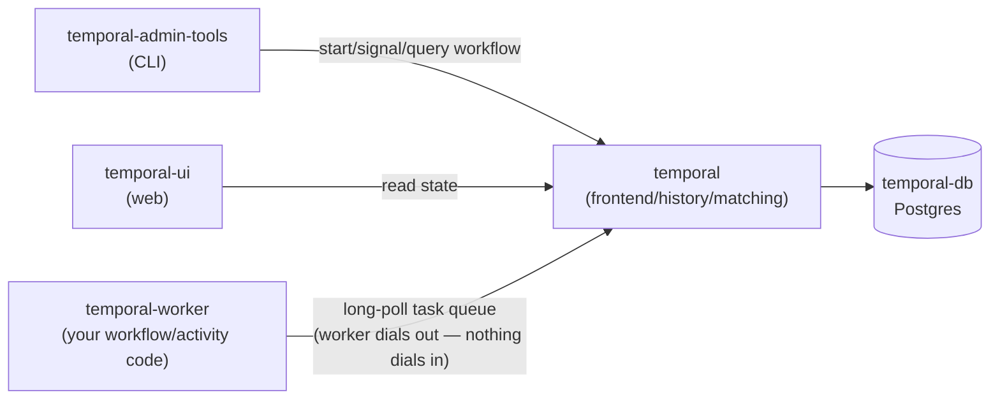

# Temporal

[← Services Reference](../../11-services-reference.md) | [Home](../../../setup.md)

---

**Purpose:** Durable execution engine for reliable distributed workflows — automatic retries, state persistence, and long-running processes that survive crashes.
**Port:** `8138` (host) → `8080` (container, `temporal-ui`) | **Data:** DB in a named volume; no `DATA_ROOT`-scoped app data | **Requires:** Postgres

## Setup

```bash
cp services/temporal/.env.example services/temporal/.env
# set POSTGRES_PASSWORD
uv run homeserver.py dev up temporal
```

`temporal-worker` seeds its own live code directory
(`service_data/data/temporal/worker/`) with the starter workflows below on
its first-ever start — no manual copy needed. See "Where your workflow
code actually lives" below for the mechanism and how to opt out.

Open `https://temporal.<domain>/` (or `http://<host>:8138` in dev) — no login/setup wizard, the UI is open to anyone who can reach it (see Notes).

## Architecture — 7 containers; the deprecated `temporalio/auto-setup` image is no longer used

- `temporal-db` — Postgres, `DB=postgres12` driver (works for any Postgres 12+, not a version pin — this repo uses `postgres:18.4-alpine` like every other service here, not the `postgres:16` the official `.env` happens to pin)
- `temporal-schema-setup` — one-shot (`temporalio/admin-tools`, `restart: "no"`): runs `temporal-sql-tool create`/`setup-schema`/`update-schema` for both the main and visibility databases before the server starts. Replaces what the deprecated `temporalio/auto-setup` image used to do automatically at boot; idempotent (a no-op once already applied).
- `temporal` — `temporalio/server` image (not `auto-setup`): runs the actual server (frontend/history/matching/internal-worker services bundled in one process); expects the schema to already exist, which `temporal-schema-setup` provides
- `temporal-create-namespace` — one-shot (`temporalio/admin-tools`, `restart: "no"`): registers the `default`/`staging`/`production` namespaces (describe-then-create, idempotent) — replaces `auto-setup`'s automatic `default`-namespace registration, extended to three namespaces here
- `temporal-admin-tools` — the `tctl`/`temporal` CLI, for ad-hoc admin/debug commands (`docker exec -it temporal-admin-tools temporal ...`)
- `temporal-ui` — the web UI
- `temporal-worker` — **not part of Temporal's own official compose set.** See below.



The Worker never receives inbound connections — it polls the server's task queue and reports results back on the same outbound connection, which is why a Worker can crash and restart without Temporal needing to know its address.

## `temporal-worker` — a placeholder, not an official Temporal component

Unlike Airflow or Dagster, Temporal doesn't execute your workflow logic itself — a **Worker** is just a regular process (any language, official SDKs exist for Go/Java/Python/TypeScript/.NET/PHP/Ruby) that connects out to the Temporal frontend (`temporal:7233`) and runs whatever Workflow/Activity code you give it. There's no generic "Temporal worker" image to pull, because a worker with no code is meaningless — it's exactly as service-specific as Dagster's user-code container, and for the same reason gets the same one exception to this repo's image-only convention: `services/temporal/worker/Dockerfile` (`python:3.14-slim`, dependencies declared in `pyproject.toml` and installed via `uv sync --locked` against a committed `uv.lock`) installs dependencies only.

## Where your workflow code actually lives

`services/temporal/worker/*.py` is a **git-tracked template**, not what actually runs — the container reads live code from a bind mount: `service_data/data/temporal/worker/` (gitignored, your live copy). The template is also baked into the built image at `/template` purely as a seed source; `temporal-worker`'s entrypoint copies it into the bind mount **only when `worker.py` is missing there** (fresh clone, restored backup — nothing has run yet), then execs `python worker.py`. After that first copy, the two are independent — edit freely in `service_data/`, it never touches git, and a `git pull` on this repo never overwrites your own workflow code. Same relationship as `.env.example`/`.env`, just for a whole directory instead of a few variables.

That "only when missing" check means deleting an individual file you don't want (e.g. trimming down which starter workflows are present) stays deleted — but `worker.py` itself is the container's actual entrypoint, not decoration, so deleting *that* one specifically just gets it re-seeded from the template on the next restart rather than leaving the container permanently unable to start.

The check and copy both live in `worker/Dockerfile`'s `CMD`, not in `compose.yml` or `homeserver.py` — it runs fresh on every container start, not just the first:

```dockerfile
CMD ["/bin/sh", "-c", "[ -f worker.py ] || cp /template/*.py .; exec python worker.py"]
```

Read left to right: `[ -f worker.py ]` tests whether that file already exists in `/app` (the bind mount, set as `WORKDIR` earlier in the Dockerfile); `||` runs the `cp` only when that test fails (file missing); the `;` then unconditionally moves on to actually starting the worker. `exec` matters there specifically — without it, `python` would run as a child of the wrapping shell, and the shell (not `python`) would stay PID 1 inside the container; Docker sends `SIGTERM` to PID 1 on stop/restart, and a plain shell doesn't reliably forward that to a child, so restarts would hang until Docker's timeout forces a `SIGKILL`. `exec` replaces the shell process in place with `python`, so the worker itself receives shutdown signals directly.

Changing the code only needs a restart, not a rebuild:

```bash
docker restart temporal-worker
```

`worker/` ships real, working workflows instead of a truly empty scaffold — each one demonstrates a different reason to reach for Temporal specifically, and each is runnable from `temporal-admin-tools` right now. Each has its own page — description, a sequence/flow diagram, a `file:line` pointer into the real source, and the exact CLI commands to run it:

- [`RunContainerWorkflow`](examples/RunContainerWorkflow.md) — resource-bounded execution via the Docker SDK.
- [`RetryableActivityWorkflow`](examples/RetryableActivityWorkflow.md) — `RetryPolicy` retrying a flaky activity, zero hand-written retry logic.
- [`ApprovalWorkflow`](examples/ApprovalWorkflow.md) — durable wait resumed by a Signal, inspectable via a Query.
- [`OrderFulfillmentSagaWorkflow`](examples/OrderFulfillmentSagaWorkflow.md) — the Saga pattern: sequential steps with compensation on failure.
- [`MaterializeDagsterAssetWorkflow`](examples/MaterializeDagsterAssetWorkflow.md) — cross-service capstone: durably orchestrates a Dagster job via GraphQL.
- [`BatchProcessingWorkflow` / `GreetSourceWorkflow`](examples/BatchProcessingWorkflow.md) — composition via Child Workflows, `--start-delay` too.
- [`DelayedReminderWorkflow`](examples/DelayedReminderWorkflow.md) — a durable timer that survives the worker restarting.
- [`ConfigurableCounterWorkflow`](examples/ConfigurableCounterWorkflow.md) — Update (with a validator) alongside Signal.
- [`RecurringPollWorkflow`](examples/RecurringPollWorkflow.md) — Continue-As-New, an unbounded loop with bounded Event History.
- [`ReferenceWorkflow`](examples/ReferenceWorkflow.md) — reference: every `execute_activity()`/`RetryPolicy` option, real defaults.
- [`LocalActivityWorkflow`](examples/LocalActivityWorkflow.md) — `execute_local_activity()`, no Task Queue round-trip.
- [`CancelableWorkflow`](examples/CancelableWorkflow.md) — cancellation genuinely delivered into a heartbeating Activity.
- [`AsyncCompletionWorkflow`](examples/AsyncCompletionWorkflow.md) — an Activity completed later by a separate process holding only a token.
- [`ConcurrencyLimitedWorkflow`](examples/ConcurrencyLimitedWorkflow.md) — `Worker(max_concurrent_activities=20)` actually capping throughput.

Keep the `activities.py`/`workflows.py` split if an activity needs a non-deterministic import (`docker`, `requests`, anything with I/O) — Temporal's sandbox rejects those inside a workflow's own module even when only the activity uses them (bit this exact setup during development; see the comment at the top of `activities.py`).

**Native scheduling**, independent of Airflow: any workflow can run on a cron without a separate scheduler service. Modern Temporal uses first-class Schedule objects (`temporal schedule create`), not the deprecated `cron_schedule` workflow-start parameter — `--cron`/`--calendar`/`--interval` are all supported. Verified with a real running Schedule (`--interval 1m` against `GreetSourceWorkflow`, so it was actually observable within a couple minutes instead of waiting for a real cron tick): it auto-started a new Workflow Execution every 60 seconds, each with its own timestamped Workflow ID (`greet-scheduled-2026-08-15T21:27:00Z`, `...T21:28:00Z`), both completed — then paused (not deleted) so `schedule describe` still shows the evidence (`ActionCounts: {"Total":2,...}`) without it running forever:

```bash
docker exec -it temporal-admin-tools temporal schedule create --address temporal:7233 \
  --schedule-id daily-retry-demo --cron "0 6 * * *" \
  --workflow-id daily-run --task-queue homeserver --type RetryableActivityWorkflow --input '"scheduled"'
docker exec -it temporal-admin-tools temporal schedule describe --address temporal:7233 --schedule-id daily-retry-demo
docker exec -it temporal-admin-tools temporal schedule toggle --address temporal:7233 --schedule-id daily-retry-demo --pause --reason "not needed yet"
```

**Batch operations** — acting on many Workflow Executions at once via a search query, instead of one Workflow ID at a time. Tracked as its own job (`temporal batch list`/`describe`), separate from the workflows it acts on. Verified: started 3 `ApprovalWorkflow` instances (`approval-batch-1/2/3`, each `pending`), then a single command signaled all three simultaneously —

```bash
docker exec -it temporal-admin-tools temporal workflow signal --address temporal:7233 \
  --query "WorkflowType='ApprovalWorkflow' AND WorkflowId STARTS_WITH 'approval-batch-' AND ExecutionStatus='Running'" \
  --name approve --reason "batch approval demo"
```

— `temporal batch describe --job-id <id>` showed `CompletedCount: 3/3, FailureCount: 0/3`, and all three workflows independently confirmed `"approved"` via query immediately after, then ran to completion. The same `--query` mechanism works for `workflow cancel`/`workflow terminate` — the real use case is something like "cancel every `Running` workflow of a type that turned out to have a bug," across however many are currently in flight, in one command instead of a loop.

## Namespaces — the isolation boundary, not the task queue name

A **Namespace** is Temporal's top-level unit of isolation: Workflow ID uniqueness, task queue scope, and visibility (search) are all namespace-scoped, even though every namespace here is served by the same cluster. Two namespaces can each have a task queue literally named `homeserver` and a workflow literally named `namespace-demo` running at the same time, with zero collision or shared state between them — same idea as a Kubernetes namespace or a DB schema, one deployment, cleanly separated tenants inside it.

This stack registers three: `default`, `staging`, `production` (`temporal-create-namespace` in `compose.yml`, idempotent — a no-op on every start after the first). `temporal-worker` runs one `Worker` loop per namespace, concurrently, in the same process (`worker.py`'s `NAMESPACES` list + `asyncio.gather`) — all three poll a task queue named `homeserver`, and never see each other's work. Every CLI example elsewhere in this doc implicitly targets `default` (Temporal assumes it when `--namespace` isn't passed); add `--namespace staging`/`--namespace production` to run the exact same commands against an isolated environment.

Verified: started the identical Workflow ID (`namespace-demo`, type `GreetSourceWorkflow`) in all three namespaces with a different input each —

```bash
for ns in default staging production; do
  docker exec temporal-admin-tools temporal workflow start --address temporal:7233 \
    --namespace "$ns" --task-queue homeserver --type GreetSourceWorkflow \
    --workflow-id namespace-demo --input "\"hello-from-$ns\""
done
```

— all three accepted with no ID collision, and each completed with its own distinct, correct result (`"processed hello-from-default"`, `"processed hello-from-staging"`, `"processed hello-from-production"`), proving genuinely independent execution, not just non-interference.

This is also the real, common reason to reach for multiple namespaces on one cluster in the first place: environment isolation (dev/staging/production sharing one Temporal deployment instead of standing up three) — and it's the exact boundary [Nexus](#notes) is built to bridge *between*, for when two namespaces need to call into each other rather than stay fully separate.

**A more concrete version of that, using a real workflow instead of the toy greeting one**: test a change to `OrderFulfillmentSagaWorkflow` in `staging` first, without it ever touching `production`.

```bash
docker exec temporal-admin-tools temporal workflow start --address temporal:7233 \
  --namespace staging --task-queue homeserver --type OrderFulfillmentSagaWorkflow \
  --workflow-id saga-staging-test --input '{"order_id": "test-1", "amount": 50}'
```

Verified: this completed normally in `staging` (`"Order test-1 fulfilled: ..."`), and querying `production` for that same workflow type immediately after (`temporal workflow list --namespace production --query "WorkflowType='OrderFulfillmentSagaWorkflow'"`) returns **zero results** — not filtered out, genuinely never existed there. Once you trust the change, the identical command with `--namespace production` (and a real `--workflow-id`, not a `-test` one) is how it actually goes live — same workflow code, same task queue name, same worker process even, just a different namespace on the client call.

## Resource caps — deliberately conservative starting points

Every container here has a `deploy.resources.limits.memory` cap (`temporal-db` 512M, `temporal` 768M, `temporal-ui` 256M, `temporal-admin-tools` 128M, `temporal-worker` 256M) — small enough that this doesn't crowd out the rest of the stack on a shared host, at the cost of being tight under real production workflow volume. If `temporal` (the server) gets OOM-killed under load (`docker inspect temporal --format '{{.State.OOMKilled}}'`), raise its cap first — it's the one actually doing frontend/history/matching work; the others are much less likely to need it.

## Upgrade gotchas hit going 1.29.1 → 1.30.4

Two things broke on this bump, both fixed live and reflected in `compose.yml` already — worth knowing before bumping versions again:

- **`temporal-db`'s `max_connections=50` was too low** — Temporal's bundled frontend/history/matching/worker roles plus `temporal-schema-setup`/`temporal-admin-tools`/`temporal-create-namespace` all dial in around the same time on a cold start, and 50 wasn't enough headroom: `temporal-db` started refusing connections with `sorry, too many clients already`, which kept `temporal` permanently unhealthy. Raised to 100 (matches what a stock `postgres` image ships with by default) — the extra memory cost is connection-slot bookkeeping only, not per-connection buffers, so it stays well inside the existing 512M cap.
- **The bundled `temporal` CLI is gone from `temporalio/server`** — somewhere after 1.29.1 the image stopped shipping a separate `temporal` binary (only `temporal-server` remains), so the old healthcheck (`CMD temporal operator cluster health ...`) failed with `exec: "temporal": executable file not found` and the container could never report healthy, independent of the Postgres issue above. Replaced with `nc -z temporal 7233` — verified `nc`/`wget` are present in this image, `temporal`/`temporal-server`/CLI tools are not. Also had to target the container's own name (`temporal`), not `localhost`: the frontend gRPC port binds only the container's actual network IP, not `127.0.0.1` — `nc -z localhost 7233` connection-refused every time even once the server was actually listening.
- **`temporal-ui`'s own healthcheck had the same class of bug, separately** — `temporalio/ui:2.53.3` doesn't have `curl` either (`curl: not found`), so its `CMD-SHELL curl -f http://localhost:8080/ ...` healthcheck always failed and the container was permanently reported unhealthy even while serving requests fine. Unlike the server container above, `wget` alone was enough here (`wget -qO- http://localhost:8080/ || exit 1`) — no need for the `nc`/container-name workaround since this is a plain HTTP UI, not a gRPC port.

## Notes

- **No built-in auth on the UI** — Temporal's own auth is enterprise-only. **Gated behind Authentik forward-auth instead** — `temporal.${DOMAIN}` requires an Authentik login at the nginx layer before any request reaches the container. See [Forward-auth for other services](../authentik.md#forward-auth-for-other-services-nginx-auth_request) in `authentik.md`. Note this only covers the UI vhost — the `temporal-worker`/`temporal-admin-tools` connection to the server (`temporal:7233`, internal gRPC) isn't proxied publicly at all, so it was never reachable from outside regardless.
- `DYNAMIC_CONFIG_FILE_PATH` points at `dynamicconfig/development-sql.yaml` — Temporal's own official "development" config (`system.forceSearchAttributesCacheRefreshOnRead: true`), fine for a homelab's workflow volume; their docs explicitly say not to use it in a real production deployment (immediate-consistency search-attribute reads have a real perf cost at scale).
- Elasticsearch is **not** deployed — the official compose set has an Elasticsearch variant for advanced visibility queries; this uses the plain SQL (Postgres) visibility store instead, which covers normal workflow search/filtering fine and is one less container to run.
- **Nexus (cross-namespace/cross-cloud workflow calls, GA) is not set up here** — worth knowing it exists, not something this stack currently uses. Nexus lets one Temporal namespace call into Workflows/Signals/Updates/Queries running in a *different* namespace (even a different cluster/cloud) through a versioned API contract, instead of hand-rolling a webhook or a REST call between them — the same problem `MaterializeDagsterAssetWorkflow` solves today by calling Dagster's GraphQL API directly, generalized to Temporal-to-Temporal. Not added here because this deployment only runs a single namespace (`default`) — Nexus's whole value is connecting *separate* namespaces owned by separate teams/services, which doesn't apply until there's a second namespace worth isolating. If that ever changes: `temporal operator nexus endpoint create`, then a Nexus service/operation defined in the calling workflow's worker — see [Temporal's Nexus docs](https://docs.temporal.io/nexus).
- **Typed Search Attributes are not demoed here** — `workflow.upsert_search_attributes()` lets a workflow tag itself with custom, queryable business data (e.g. `CustomerId`, `OrderAmount`), distinct from the built-in-field `--query "WorkflowType='...'"` filtering already used elsewhere in this doc (Batch operations). Not added because using one requires registering its name/type on the server first (`temporal operator search-attribute create`), a one-time admin step none of this repo's other examples need.

---

[← Services Reference](../../11-services-reference.md) | [Home](../../../setup.md)
