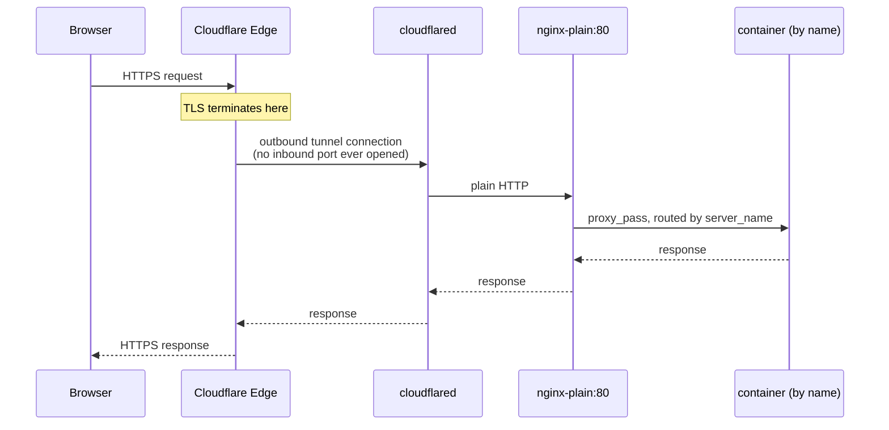

# Homeserver

> Self-hosted personal cloud on your own hardware.
> Replaces Google Drive, Google Photos, Netflix, and more.
> Family-ready with individual logins.

---

## What's in the stack

64 services grouped the same way as the [landing page](docs/07-landing.md) tiles. Bare
links — hover (or tap-and-hold on mobile) any name for what it does and what it replaces.

### Storage & Media

[Nextcloud](docs/services/nextcloud.md "Personal file storage, sync, and sharing. Google Drive alternative with calendar, contacts, and more.") ·
[Immich](docs/services/immich.md "Self-hosted photo and video backup. Google Photos alternative with facial recognition and smart search.") ·
[Jellyfin](docs/services/jellyfin.md "Stream movies, TV shows, and music from your own server. Netflix alternative with no subscriptions.") ·
[Syncthing](docs/services/syncthing.md "Continuous P2P file sync between your devices. No cloud middleman — direct device-to-device. Replaces: Dropbox Sync.") ·
[Audiobookshelf](docs/services/audiobookshelf.md "Self-hosted audiobook and podcast server. Stream from anywhere with the mobile app. Replaces: Audible.")

### Productivity

**Notes & Knowledge** — [Trilium Notes](docs/services/trilium.md "Hierarchical, scriptable notes with attributes and relations. A personal wiki + database hybrid.") · [SilverBullet](docs/services/silverbullet.md "Markdown notes with a query language over your own space. Lightweight, single space. Replaces: Obsidian (self-hosted).") · [Outline](docs/services/outline.md "Polished self-hosted team wiki and docs, good search. Logs in via Authentik. Replaces: Notion / Confluence.") · [BookStack](docs/services/bookstack.md "Shelves/books/chapters/pages wiki. One book per homelab service, one page per gotcha. Replaces: Confluence.") · [AppFlowy](docs/services/appflowy.md "Open-source Notion alternative. Collaborative docs, databases, kanban, and AI writing tools.") · [Excalidraw](docs/services/excalidraw.md "Hand-drawn-style whiteboard for diagrams and sketches. Local-only by default, no server-side storage. Replaces: draw.io / Miro.") · [Karakeep](docs/services/karakeep.md "Bookmark manager with AI auto-tagging and full-text search of saved pages. Replaces: Pocket / Raindrop.") · [Nextcloud Whiteboard](docs/services/whiteboard.md "Infinite-canvas whiteboard for sketching and diagramming together in real time, built into Nextcloud — a self-hosted Miro alternative.")

**Project & Task Mgmt** — [Vikunja](docs/services/vikunja.md "To-do list and task management app. Organize projects, set due dates, and track work. Replaces: Todoist.") · [OpenProject](docs/services/openproject.md "Open-source project management. Gantt charts, Kanban, sprints, wikis and time tracking. Replaces: Jira / Asana.") · [Plane](docs/services/plane.md "Modern open-source project management. Issues, cycles, modules and analytics. Jira alternative.")

**Documents** — [Paperless-ngx](docs/services/paperless.md "Scan, index, and archive all your documents. Full-text search with OCR — go paperless. Replaces: Scansnap cloud.") · [Stirling PDF](docs/services/stirling-pdf.md "Full PDF toolkit with Word/Excel conversion via LibreOffice. Start manually on demand. Replaces: Adobe Acrobat.") · [Documenso](docs/services/documenso.md "Sign documents electronically and collect signatures from others — a self-hosted alternative to DocuSign.") · [ONLYOFFICE](docs/services/onlyoffice.md "Real-time collaborative editing for Word, Excel, and PowerPoint documents stored in Nextcloud — a self-hosted Microsoft Office alternative built for native .docx/.xlsx/.pptx compatibility.")

**Finance & Business** — [Firefly III](docs/services/firefly.md "Personal finance manager. Track income, expenses, budgets and accounts in one place. Replaces: YNAB / Mint.") · [InvoiceShelf](docs/services/invoiceshelf.md "Self-hosted invoicing and billing. Create invoices, track expenses, accept payments. Replaces: FreshBooks.") · [Cal.com](docs/services/calcom.md "Share a booking page so people can schedule meetings with you automatically — a self-hosted alternative to Calendly.") · [OrangeHRM](docs/services/orangehrm.md "Open-source HR management — employee records, leave, time tracking, recruitment. Replaces: BambooHR / Workday.")

**Reading & Feeds** — [Miniflux](docs/services/miniflux.md "Minimalist RSS reader. Follow blogs, news, and podcasts without tracking or algorithms. Replaces: Feedly.") · [Wallabag](docs/services/wallabag.md "Read-it-later app, self-hosted Pocket alternative. Saves a clean, readable copy of articles.") · [Listmonk](docs/services/listmonk.md "Send and manage email newsletters and mailing lists — a self-hosted alternative to Mailchimp.")

**Chat & Messaging** — [Mattermost](docs/services/mattermost.md "Slack-style team chat: channels, DMs, threads. Lighter self-hosted footprint than Rocket.Chat/Zulip.") · [Rocket.Chat](docs/services/rocketchat.md "Full-featured team chat with channels, apps, and webhooks. Heaviest of the chat playground trio (MongoDB replica set + NATS). Replaces: Slack.") · [Zulip](docs/services/zulip.md "Topic-threaded team chat, good for organized async discussion. Postgres + RabbitMQ + Redis + Memcached backing services. Replaces: Slack.")

**AI** — [Open WebUI](docs/services/open-webui.md "Chat interface for AI models running entirely on your own hardware, served by Ollama — like ChatGPT, but private, offline, and free to use.") · [Ollama](docs/services/ollama.md "Runs large language models locally and serves them to Open WebUI over the internal network — the actual AI engine behind the chat interface. Also reachable directly (behind login) for other tools that speak the Ollama API.")

**Home** — [Mealie](docs/services/mealie.md "Recipe manager and meal planner. Save recipes, plan your week, and generate shopping lists. Replaces: Recipe apps.") · [HomeBox](docs/services/homebox.md "Home inventory tracker with QR labels. Log what's in every box, drawer, and closet, then scan to find it. Replaces: Sortly.")

### Dev & Security

**Git & CI** — [Forgejo](docs/services/forgejo.md "Self-hosted Git with repos, issues, pull requests, and CI/CD actions. Open governance, low resource usage. Replaces: GitHub.") · [GitLab CE](docs/services/gitlab.md "Full DevOps platform. Self-hosted Git with CI/CD pipelines, container registry, and issue tracking. Replaces: GitHub / GitLab.com.")

**Identity & Secrets** — [Vaultwarden](docs/services/vaultwarden.md "Self-hosted password manager. Bitwarden-compatible — use any Bitwarden app to sync passwords. Replaces: 1Password / LastPass.") · [Authentik](docs/services/authentik.md "Single sign-on for all your services. One login, one identity, full access control. Replaces: Okta / Auth0.")

**Automation & Low-code** — [n8n](docs/services/n8n.md "Self-hosted workflow automation — connect apps and services together with a drag-and-drop builder, like Zapier or Make, without writing code.") · [Airflow](docs/services/airflow/airflow.md "Programmatically author, schedule, and monitor workflows as Python DAGs. The industry-standard workflow orchestrator.") · [Temporal](docs/services/temporal/temporal.md "Durable execution engine for reliable distributed workflows — automatic retries, state persistence, and long-running processes that survive crashes.") · [Dagster](docs/services/dagster/dagster.md "Data orchestrator built around software-defined assets — track lineage, materialize pipelines, observe data quality. Ships with an empty placeholder pipeline.") · [NocoDB](docs/services/nocodb.md "Turn a database into an easy-to-use spreadsheet — browse, filter, and edit data without writing SQL. A self-hosted alternative to Airtable.") · [Supabase](docs/services/supabase.md "Self-hosted backend for building apps — database, user logins, file storage, and live data updates in one place. A self-hosted alternative to Firebase.")

**Tools** — [IT-Tools](docs/services/it-tools.md "~80 browser-only dev utilities in one place: JWT decoder, cron parser, hash/UUID/base64, regex tester. Replaces: assorted sketchy websites.") · [Mailpit](docs/services/mailpit.md "SMTP catcher for the whole stack — point any service at it and see the email it would have sent, nothing ever actually delivered. Replaces: Mailtrap.") · [Coolify](docs/services/coolify.md "Deploy your own apps and websites from a Git repo with one click — a self-hosted alternative to Vercel or Heroku.") · [Penpot](docs/services/penpot.md "Design app mockups, websites, and interfaces, then share them for feedback — a self-hosted alternative to Figma.") · [Plausible](docs/services/plausible.md "See how many people visit your websites and what they click on, without tracking cookies — a privacy-friendly alternative to Google Analytics.") · [Atuin](docs/services/atuin.md "Sync your command-line history across all your machines and search it with context (folder, exit code) — like browser history, but for your terminal. Replaces: plain bash/zsh history file.")

### System

[Uptime Kuma](docs/services/uptime-kuma.md "Monitor all your services and get alerted when something goes down. Self-hosted uptime tracking. Replaces: Pingdom.") ·
[Beszel](docs/services/beszel.md "Lightweight server monitoring. CPU, memory, disk, and Docker container stats with alerts. Replaces: Netdata / Datadog.") ·
[Observability](docs/services/observability.md "Dashboards showing how healthy and busy every service in this stack is — CPU, memory, and searchable logs in one place, powered by Grafana. Replaces: Datadog / Grafana Cloud.") ·
[Portainer](docs/services/portainer.md "Docker container management UI. Inspect, start/stop, and manage all containers from the browser.") ·
[Dockge](docs/services/dockge.md "Fancy Docker Compose stack manager. Deploy and manage stacks via a clean web UI.") ·
[Dozzle](docs/services/dozzle.md "Real-time Docker container log viewer in the browser. Quickly tail logs from any running container.") ·
[Guacamole](docs/services/guacamole.md "Remote-control another computer from any web browser, no software to install — over VNC, RDP, or SSH, from your LAN or anywhere on the internet. Replaces: TeamViewer / AnyDesk.") ·
[Browser Hub](docs/services/browser-hub.md "One login, then pick from five real browsers (Firefox, Chromium, Ungoogled Chromium, Brave, Mullvad Browser) running on the server and controlled from any device — the page loads and the traffic goes out from your server, so it reaches sites your local connection can't. Each browser only exists at its own /path/ here, not its own web address.") ·
[Firefox](docs/services/firefox.md "General-purpose remote Firefox — part of the Browser Hub, one login for all five browsers here.") ·
[Chromium](docs/services/chromium.md "Remote Chromium — for sites/tools that specifically need Chrome/Chromium. Part of the Browser Hub, one login for all five browsers here.") ·
[Ungoogled Chromium](docs/services/ungoogled-chromium.md "Chromium with Google's tracking and telemetry stripped out. Part of the Browser Hub, one login for all five browsers here.") ·
[Brave](docs/services/brave.md "Privacy-focused, ad-blocking-by-default remote browser. Part of the Browser Hub, one login for all five browsers here.") ·
[Mullvad Browser](docs/services/mullvad-browser.md "Hardened, anti-fingerprinting Firefox fork built with the Tor Project — does not itself route traffic through the Tor network. Part of the Browser Hub, one login for all five browsers here.") ·
[AdGuard Home](docs/services/adguard-home.md "Network-wide DNS ad/tracker blocking. DNS itself is LAN-only (port 53) — this links to the admin panel. Replaces: Pi-hole.") ·
[wg-easy](docs/services/wg-easy.md "Self-hosted WireGuard VPN with a web UI. Full-tunnel or split-tunnel client profiles, reachable over IPv6 to work around ISP CGNAT with zero port forwarding. Replaces: Tailscale.") ·
[ntfy](docs/services/ntfy.md "Self-hosted push notifications. Scripts and services curl a message straight to your phone. Replaces: Pushover / Pushbullet.") ·
[Docs](docs/services/docs.md "Searchable site over every doc in this repo — setup guides, service reference, all per-service notes, live off the source files. Replaces: Read the Docs.")

### Infrastructure

[Cloudflare Tunnel](docs/services/cloudflared.md "Public HTTPS access, no open ports — replaces Port forwarding") ·
[nginx-plain](docs/04-nginx.md "Reverse proxy, default — replaces Manual nginx config") ·
Nginx Proxy Manager (optional, UI-based reverse proxy — see [04 — Nginx](docs/04-nginx.md)) ·
[CrowdSec](docs/services/crowdsec.md "Collaborative intrusion detection, detection-only, see TODO.md — replaces fail2ban") ·
[Landing page](docs/07-landing.md "Service dashboard with live status")

Full per-service detail (ports, setup steps, gotchas): [Services Reference](docs/11-services-reference.md).

---

## How traffic flows



Cloudflare handles TLS. Internal traffic is plain HTTP.
`nginx-plain` resolves services by Docker container name on the `homeserver` network.

> **Optional:** replace `nginx-plain` with Nginx Proxy Manager (NPM) for a UI-based config
> and Let's Encrypt. See [04 — Nginx](docs/04-nginx.md).

---

## Requirements

- Any x86-64 machine (laptop, mini PC, old desktop) — Linux, Mac, or Windows all work
- Minimum 4 GB RAM (8 GB+ recommended)
- One drive for OS + Docker (SSD preferred)
- One drive for data (internal or USB, formatted ext4)
- Ubuntu 24.04 LTS (or any Debian-based distro) for the primary/production deployment target described below — Docker Desktop works fine on Mac/Windows for development
- [uv](https://docs.astral.sh/uv/) to run `homeserver.py` (`uv sync` once, then `uv run homeserver.py ...`) — no other dependencies, it's stdlib-only. `pyproject.toml` pins the exact Python minor version (currently 3.14); `uv` downloads a matching interpreter automatically if you don't already have one, so you don't need to install Python yourself
- A domain on Cloudflare — or use [Tailscale](docs/03b-tailscale.md) for local/testing access

---

## Setup path

Go through these in order. Each doc links to the next.

| # | Doc | What you do |
| --- | --- | --- |
| [01](docs/01-data-drive.md) | Prepare Data Drive | Format the data drive, mount it, create the folder structure |
| [02](docs/02-docker-network.md) | Docker + Shared Network | Install Docker, create the `homeserver` bridge network |
| [03](docs/03-access.md) | **Choose access method** | Pick Cloudflare (public) or Tailscale (private) — only do one |
| [03a](docs/03a-cloudflare.md) | ↳ Cloudflare Tunnel | Set up cloudflared + DNS for public HTTPS access |
| [03b](docs/03b-tailscale.md) | ↳ Tailscale | Private access by IP, no domain needed |
| [04](docs/04-nginx.md) | Reverse proxy | nginx-plain (default) or Nginx Proxy Manager (optional UI) |
| [05](docs/05-nextcloud.md) | Nextcloud | File storage, family accounts, external storage |
| [06](docs/06-immich.md) | Immich | Photo backup, mobile app, face recognition (optional) |
| [07](docs/07-landing.md) | Landing Page | Service dashboard showing live status for all services |
| [08](docs/08-maintenance.md) | Maintenance | Monthly updates, health checks, remote management, resource-constrained hosts, troubleshooting |
| [09](docs/09-firewall.md) | Firewall | UFW rules, port binding strategy (dev vs prod) |
| [10](docs/10-new-services.md) | New Services | Add any service from the stack — step-by-step for each |
| [11](docs/11-services-reference.md) | Services Reference | All ports, proxy config, per-service notes |
| [12](docs/12-orchestration.md) | Orchestration Services | Airflow vs. Temporal vs. Dagster — what each is actually for and how they compose (only relevant if you're using one of the three) |
| [13](docs/13-auth-posture.md) | Auth Posture | Which services have real accounts vs. a shared password vs. no login at all, and which are realistic candidates for Authentik forward-auth |

**Start here → [01 — Prepare Data Drive](docs/01-data-drive.md)**

---

## Reference

Quick links for day-to-day use once the stack is running.

| Doc | When to use |
| --- | --- |
| [Services Reference](docs/11-services-reference.md) | Look up any service's port, proxy config, or setup notes |
| [Maintenance](docs/08-maintenance.md) | Update images, check health, troubleshoot |
| [Docker Cheatsheet](docs/docker-cheatsheet.md) | Images, containers, volumes, networks, cleanup commands |
| [Kubernetes Pilot](docs/12-kubernetes-pilot.md) | Experimental, parallel to Compose — not required setup |

---

## Quick commands

```bash
# Service tiers — MIN ⊂ CORE ⊂ ALL
uv run homeserver.py dev up min          # infrastructure only (beszel, cloudflared, nginx-plain, landing, docs, portainer)
uv run homeserver.py dev up core         # min + nextcloud
uv run homeserver.py dev up all          # everything (core + all extra services)

uv run homeserver.py dev down min        # stop min (reverse order)
uv run homeserver.py dev down core       # stop core (reverse order)
uv run homeserver.py dev down all        # stop everything, including optional profiles

# Start / stop one service
uv run homeserver.py dev up jellyfin
uv run homeserver.py dev down jellyfin

# Follow logs
uv run homeserver.py dev logs nextcloud

# Immich — ML (face/object recognition) starts by default; exclude it with:
uv run homeserver.py dev up immich --no-ml

# Pull latest images and recreate
uv run homeserver.py dev update all
uv run homeserver.py dev update running  # only currently running services

# Production (ports bound to 127.0.0.1 only)
uv run homeserver.py prod up all
```

**Backups are automatic:** `down` snapshots a service's data every time it stops (add `--no-backup` to skip). See the `homeserver-backups` skill for `snapshots`/`restore --snapshot`/retention config — this is the safety net for both routine restarts and migrating to a different machine.

---

## Folder structure

```text
~/homeserver/
├── homeserver.py          ← manage all services (uv run homeserver.py ...)
├── .env                   ← set DOMAIN= here once
├── docker/                ← caps Docker's own total CPU/memory/disk usage on the host
├── kubernetes/            ← parallel Kubernetes pilot (not a replacement for the stack below)
└── services/
    ├── nginx-plain/           ← default reverse proxy
    ├── nginx/                 ← optional: Nginx Proxy Manager
    ├── cloudflared/
    ├── landing/
    ├── nextcloud/
    ├── onlyoffice/
    ├── whiteboard/
    ├── immich/
    ├── jellyfin/
    ├── vaultwarden/
    ├── guacamole/
    ├── firefox/
    ├── chromium/
    ├── ungoogled-chromium/
    ├── brave/
    ├── mullvad-browser/
    ├── portainer/
    ├── paperless/
    ├── stirling-pdf/
    ├── stirling-pdf-lite/
    ├── mealie/
    ├── homebox/
    ├── forgejo/
    ├── gitlab/
    ├── uptime-kuma/
    ├── dozzle/
    ├── dockge/
    ├── syncthing/
    ├── authentik/
    ├── miniflux/
    ├── vikunja/
    ├── trilium/
    ├── silverbullet/
    ├── outline/
    ├── bookstack/
    ├── excalidraw/
    ├── karakeep/
    ├── ntfy/
    ├── it-tools/
    ├── n8n/
    ├── airflow/
    ├── temporal/
    ├── dagster/
    ├── mailpit/
    ├── mattermost/
    ├── rocketchat/
    ├── zulip/
    ├── docs/
    ├── crowdsec/
    ├── wallabag/
    ├── atuin/
    ├── adguard-home/
    ├── orangehrm/
    ├── nocodb/
    ├── listmonk/
    ├── documenso/
    ├── calcom/
    ├── plausible/
    ├── penpot/
    ├── coolify/
    ├── supabase/
    ├── appflowy/
    ├── audiobookshelf/
    ├── openproject/
    ├── plane/
    ├── invoiceshelf/
    ├── firefly/
    ├── ollama/
    ├── open-webui/
    ├── beszel/
    ├── observability/
    └── wg-easy/
```

Service data (gitignored):

```text
service_data/
├── nginx-plain/      (certs/) — browser hub login lives in services/nginx-plain/.env, not here, see docs/services/browser-hub.md
├── nginx/            (data/, letsencrypt/) — optional NPM proxy
├── nextcloud/        (postgres/, config/, data/, custom_apps/)
├── onlyoffice/       (data/, log/, lib/)
├── whiteboard/       (empty — no persistent data, no DB)
├── immich/           (postgres/) — photo/video library lives outside this tree, in service_data/media/immich/ (kept out of DATA_ROOT so backups don't sweep it)
├── jellyfin/         (config/, cache/) — media library lives outside this tree, in service_data/media/jellyfin/; downloaded poster/fanart metadata cache also outside, in service_data/cache/jellyfin/metadata/ (same reason)
├── vaultwarden/      (data/)
├── guacamole/        (empty — DB lives in a named volume, not this tree)
├── firefox/          (config/) — browser profile/settings, served at browser.<domain>/firefox/, see docs/services/browser-hub.md
├── chromium/         (config/) — same hub, browser.<domain>/chromium/
├── ungoogled-chromium/ (config/) — same hub, browser.<domain>/ungoogled-chromium/
├── brave/            (config/) — same hub, browser.<domain>/brave/
├── mullvad-browser/  (config/) — same hub, browser.<domain>/mullvad-browser/
├── portainer/        (data/)
├── paperless/        (postgres/, app/)
├── stirling-pdf/     (configs/, logs/, customFiles/, pipeline/, tessdata/)
├── stirling-pdf-lite/ (configs/, logs/, customFiles/, pipeline/)
├── mealie/           (postgres/, data/)
├── homebox/          (data/)
├── forgejo/          (postgres/, app/)
├── gitlab/           (config/, logs/, data/)
├── uptime-kuma/      (data/)
├── dockge/           (data/) — compose stacks it manages live outside this tree, in service_data/stacks/dockge/ (same reason as immich's photo library)
├── syncthing/        (data/)
├── authentik/        (postgres/, media/, certs/, templates/)
├── miniflux/         (postgres/)
├── vikunja/          (postgres/, files/)
├── trilium/          (trilium-data/)
├── silverbullet/     (space/)
├── outline/          (postgres/, redis/, data/)
├── bookstack/        (mariadb/, config/)
├── excalidraw/       (empty — no persistent data, no DB)
├── karakeep/         (data/) — search index lives in a named volume, not this tree
├── ntfy/             (data/)
├── it-tools/         (empty — no persistent data, no DB)
├── n8n/              (postgres/, data/)
├── airflow/          (dags/, logs/, config/, plugins/) — DB lives in a named volume, not this tree
├── temporal/         (empty — DB lives in a named volume; dynamicconfig/ and worker/ are checked-in config/code, not DATA_ROOT-scoped)
├── dagster/          (empty — DB lives in a named volume; user-code/ and webserver-daemon/ are checked-in config/code, not DATA_ROOT-scoped)
├── mailpit/          (data/) — SQLite message store
├── mattermost/       (config/, data/, logs/, plugins/, client-plugins/, bleve-indexes/) — DB lives in a named volume, not this tree
├── rocketchat/       (uploads/) — MongoDB lives in named volumes, not this tree
├── zulip/            (empty — Postgres/RabbitMQ/Redis/Zulip's own /data all live in named volumes)
├── crowdsec/         (config/) — parsed decisions/DB live in a named volume, not this tree
├── wallabag/         (postgres/, data/, images/)
├── atuin/            (postgres/, config/)
├── adguard-home/     (work/, conf/)
├── orangehrm/        (mariadb/ only — app container has no data volume yet, see docs/services/orangehrm.md)
├── nocodb/           (postgres/, data/)
├── listmonk/         (postgres/, uploads/)
├── documenso/        (postgres/, data/, cert.p12 — signing certificate, generate before first start)
├── calcom/           (postgres/ only — app itself is stateless)
├── plausible/        (postgres/, clickhouse-data/, clickhouse-logs/, data/ — all named volumes)
├── penpot/           (postgres/ named volume, assets/ bind mount)
├── coolify/          (postgres/, redis/ named volumes; data/, ssh/, applications/, databases/, backups/, services/ bind mounts)
├── supabase/         (db-data/, db-config/, deno-cache/ named volumes; storage/ bind mount)
├── appflowy/         (minio/) — Postgres lives in a named volume, not this tree
├── audiobookshelf/   (config/, metadata/)
├── openproject/      (pgdata/, assets/)
├── plane/            (postgres/, uploads/, logs/)
├── invoiceshelf/     (db/, uploads/)
├── firefly/          (postgres/, upload/)
├── ollama/           (empty — models live outside this tree, in service_data/cache/ollama/, kept out of DATA_ROOT so backups don't sweep multi-GB model files)
├── open-webui/       (data/) — embedding model cache lives outside this tree, in service_data/cache/open-webui/cache/ (same reason)
├── beszel/           (data/, socket/, agent/)
├── observability/    (grafana/, prometheus/, loki/) — capped by retention (PROMETHEUS_RETENTION, LOKI_RETENTION), so kept in DATA_ROOT rather than a separate cache/ bucket despite not being regenerable
└── wg-easy/          (wg0.conf, wg-easy.db) — WireGuard server config + client/admin database
```
