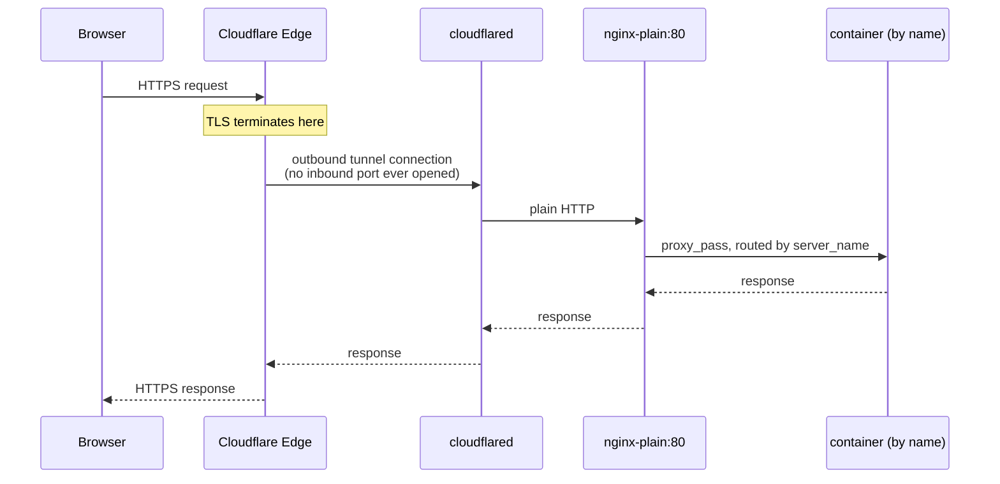

# Homeserver

> Self-hosted personal cloud on your own hardware.
> Replaces Google Drive, Google Photos, Netflix, and more.
> Family-ready with individual logins.

---

## What's in the stack

| Service | Purpose | Replaces |
| --- | --- | --- |
| [Nextcloud](docs/services/nextcloud.md) | File storage + sharing | Google Drive |
| [Immich](docs/services/immich.md) | Photo management | Google Photos |
| [Jellyfin](docs/services/jellyfin.md) | Media streaming | Netflix / Plex |
| [Vaultwarden](docs/services/vaultwarden.md) | Password manager | 1Password / LastPass |
| [Paperless-ngx](docs/services/paperless.md) | Document management | Scansnap cloud |
| [Stirling PDF](docs/services/stirling-pdf.md) | PDF toolkit | Adobe Acrobat |
| [Mealie](docs/services/mealie.md) | Recipe manager | Recipe apps |
| [HomeBox](docs/services/homebox.md) | Home inventory tracker with QR labels | Sortly |
| [Open WebUI + Ollama](docs/services/open-webui.md) | Local LLM chat interface | ChatGPT |
| [Forgejo](docs/services/forgejo.md) | Git hosting | GitHub |
| [GitLab CE](docs/services/gitlab.md) | Full DevOps platform | GitHub / GitLab.com |
| [Uptime Kuma](docs/services/uptime-kuma.md) | Service monitoring | Pingdom |
| [Beszel](docs/services/beszel.md) | Server resource monitoring | Netdata / Datadog |
| [Syncthing](docs/services/syncthing.md) | Peer-to-peer file sync | Dropbox Sync |
| [Authentik](docs/services/authentik.md) | Identity provider / SSO | Okta / Auth0 |
| [Miniflux](docs/services/miniflux.md) | RSS reader | Feedly |
| [Vikunja](docs/services/vikunja.md) | To-do / task management | Todoist |
| [Trilium Notes](docs/services/trilium.md) | Hierarchical, scriptable notes | Personal wiki / Evernote |
| [SilverBullet](docs/services/silverbullet.md) | Markdown notes with a query language | Obsidian (self-hosted) |
| [Outline](docs/services/outline.md) | Self-hosted team wiki / docs | Notion / Confluence |
| [BookStack](docs/services/bookstack.md) | Shelves/books/chapters/pages wiki | Confluence |
| [Excalidraw](docs/services/excalidraw.md) | Hand-drawn-style whiteboard/diagrams | draw.io / Miro |
| [Karakeep](docs/services/karakeep.md) | Bookmark manager with AI auto-tagging | Pocket / Raindrop |
| [ntfy](docs/services/ntfy.md) | Self-hosted push notifications | Pushover / Pushbullet |
| [IT-Tools](docs/services/it-tools.md) | ~80 browser-only dev utilities | assorted sketchy websites |
| [n8n](docs/services/n8n.md) | Self-hosted workflow automation | Zapier / Make |
| [Airflow](docs/services/airflow.md) | Programmatic workflow orchestration (Python DAGs) | — |
| [Temporal](docs/services/temporal.md) | Durable execution engine for reliable distributed workflows | — |
| [Dagster](docs/services/dagster.md) | Data orchestrator built around software-defined assets | — |
| [Mailpit](docs/services/mailpit.md) | Shared SMTP catcher — see what any service in this stack would have emailed, nothing ever really sent | Mailtrap |
| [Mattermost](docs/services/mattermost.md) | Slack-style team chat — lightest of the chat playground trio | Slack |
| [Rocket.Chat](docs/services/rocketchat.md) | Full-featured team chat — heaviest of the trio (MongoDB replica set + NATS) | Slack |
| [Zulip](docs/services/zulip.md) | Topic-threaded team chat — Postgres + RabbitMQ + Redis + Memcached | Slack |
| [Docs](docs/services/docs.md) | Searchable site over every doc in this repo, live off the source `.md` files | Read the Docs |
| [CrowdSec](docs/services/crowdsec.md) | Collaborative intrusion detection (detection-only, see TODO.md) | fail2ban |
| [Wallabag](docs/services/wallabag.md) | Read-it-later app | Pocket |
| [Atuin](docs/services/atuin.md) | Shell history sync across machines | plain bash/zsh history file |
| [AdGuard Home](docs/services/adguard-home.md) | Network-wide DNS ad/tracker blocking | Pi-hole |
| [PhotoPrism](docs/services/photoprism.md) | AI-powered photo library (manual-only, redundant with Immich) | Google Photos (alt.) |
| [OrangeHRM](docs/services/orangehrm.md) | Open-source HR management | BambooHR / Workday |
| [NocoDB](docs/services/nocodb.md) | Spreadsheet UI over a database | Airtable |
| [Listmonk](docs/services/listmonk.md) | Newsletter / mailing list manager | Mailchimp |
| [Documenso](docs/services/documenso.md) | Document e-signing | DocuSign |
| [Cal.com](docs/services/calcom.md) | Scheduling / booking pages | Calendly |
| [Plausible](docs/services/plausible.md) | Privacy-friendly web analytics | Google Analytics |
| [Penpot](docs/services/penpot.md) | Design / prototyping tool | Figma |
| [Coolify](docs/services/coolify.md) | Self-hosted PaaS for deploying other projects | Vercel / Heroku |
| [Supabase](docs/services/supabase.md) | Self-hosted backend platform (DB, auth, storage, functions) | Firebase |
| [Observability](docs/services/observability.md) | Metrics + log dashboards (Grafana + Prometheus + Loki + Alloy + cAdvisor + node-exporter) | Datadog / Grafana Cloud |
| [Audiobookshelf](docs/services/audiobookshelf.md) | Audiobooks + podcasts | Audible |
| [OpenProject](docs/services/openproject.md) | Project management | Jira / Asana |
| [Plane](docs/services/plane.md) | Issue tracking | Linear / Jira |
| [InvoiceShelf](docs/services/invoiceshelf.md) | Invoicing | FreshBooks |
| [Firefly III](docs/services/firefly.md) | Personal finance manager | YNAB / Mint |
| [AppFlowy](docs/services/appflowy.md) | Notion alternative | Notion |
| [Portainer](docs/services/portainer.md) | Container management UI | — |
| [Dockge](docs/services/dockge.md) | Compose stack manager UI | — |
| [Guacamole](docs/services/guacamole.md) | Remote desktop gateway (VNC/RDP/SSH) | TeamViewer / AnyDesk |
| [Dozzle](docs/services/dozzle.md) | Docker log viewer | — |
| nginx-plain | Reverse proxy (default) | Manual nginx config |
| Nginx Proxy Manager | Reverse proxy (optional, UI-based) | — |
| Landing page | Service dashboard with live status | — |
| Cloudflare Tunnel | Public HTTPS access, no open ports | Port forwarding |

---

## How traffic flows



Cloudflare handles TLS. Internal traffic is plain HTTP.
`nginx-plain` resolves services by Docker container name on the `homeserver` network.

> **Optional:** replace `nginx-plain` with Nginx Proxy Manager (NPM) for a UI-based config
> and Let's Encrypt. See [04 — Nginx](docs/04-nginx.md).

---

## Requirements

- Any x86-64 machine (laptop, mini PC, old desktop) — Linux, Mac, or Windows all work
- Minimum 4 GB RAM (8 GB+ recommended)
- One drive for OS + Docker (SSD preferred)
- One drive for data (internal or USB, formatted ext4)
- Ubuntu 24.04 LTS (or any Debian-based distro) for the primary/production deployment target described below — Docker Desktop works fine on Mac/Windows for development
- [uv](https://docs.astral.sh/uv/) to run `homeserver.py` (`uv sync` once, then `uv run homeserver.py ...`) — no other dependencies, it's stdlib-only. `pyproject.toml` pins the exact Python minor version (currently 3.14); `uv` downloads a matching interpreter automatically if you don't already have one, so you don't need to install Python yourself
- A domain on Cloudflare — or use [Tailscale](docs/03b-tailscale.md) for local/testing access

---

## Setup path

Go through these in order. Each doc links to the next.

| # | Doc | What you do |
| --- | --- | --- |
| [01](docs/01-data-drive.md) | Prepare Data Drive | Format the data drive, mount it, create the folder structure |
| [02](docs/02-docker-network.md) | Docker + Shared Network | Install Docker, create the `homeserver` bridge network |
| [03](docs/03-access.md) | **Choose access method** | Pick Cloudflare (public) or Tailscale (private) — only do one |
| [03a](docs/03a-cloudflare.md) | ↳ Cloudflare Tunnel | Set up cloudflared + DNS for public HTTPS access |
| [03b](docs/03b-tailscale.md) | ↳ Tailscale | Private access by IP, no domain needed |
| [04](docs/04-nginx.md) | Reverse proxy | nginx-plain (default) or Nginx Proxy Manager (optional UI) |
| [05](docs/05-nextcloud.md) | Nextcloud | File storage, family accounts, external storage |
| [06](docs/06-immich.md) | Immich | Photo backup, mobile app, face recognition (optional) |
| [07](docs/07-landing.md) | Landing Page | Service dashboard showing live status for all services |
| [08](docs/08-maintenance.md) | Maintenance | Monthly updates, health checks, remote management, resource-constrained hosts, troubleshooting |
| [09](docs/09-firewall.md) | Firewall | UFW rules, port binding strategy (dev vs prod) |
| [10](docs/10-new-services.md) | New Services | Add any service from the stack — step-by-step for each |
| [11](docs/11-services-reference.md) | Services Reference | All ports, proxy config, per-service notes |
| [12](docs/12-orchestration.md) | Orchestration Services | Airflow vs. Temporal vs. Dagster — what each is actually for and how they compose (only relevant if you're using one of the three) |

**Start here → [01 — Prepare Data Drive](docs/01-data-drive.md)**

---

## Reference

Quick links for day-to-day use once the stack is running.

| Doc | When to use |
| --- | --- |
| [Services Reference](docs/11-services-reference.md) | Look up any service's port, proxy config, or setup notes |
| [Maintenance](docs/08-maintenance.md) | Update images, check health, troubleshoot |
| [Docker Cheatsheet](docs/docker-cheatsheet.md) | Images, containers, volumes, networks, cleanup commands |

---

## Quick commands

```bash
# Service tiers — MIN ⊂ CORE ⊂ ALL
uv run homeserver.py dev up min          # infrastructure only (beszel, cloudflared, nginx-plain, landing, docs, portainer)
uv run homeserver.py dev up core         # min + nextcloud
uv run homeserver.py dev up all          # everything (core + all extra services)

uv run homeserver.py dev down min        # stop min (reverse order)
uv run homeserver.py dev down core       # stop core (reverse order)
uv run homeserver.py dev down all        # stop everything

# Start / stop one service
uv run homeserver.py dev up jellyfin
uv run homeserver.py dev down jellyfin

# Follow logs
uv run homeserver.py dev logs nextcloud

# Immich — ML (face/object recognition) starts by default; exclude it with:
uv run homeserver.py dev up immich --no-ml

# Pull latest images and recreate
uv run homeserver.py dev update all
uv run homeserver.py dev update running  # only currently running services

# Production (ports bound to 127.0.0.1 only)
uv run homeserver.py prod up all
```

**Backups are automatic:** `down` snapshots a service's data every time it stops (add `--no-backup` to skip). See the `homeserver-backups` skill for `snapshots`/`restore --snapshot`/retention config — this is the safety net for both routine restarts and migrating to a different machine.

---

## Folder structure

```text
~/homeserver/
├── homeserver.py          ← manage all services (uv run homeserver.py ...)
├── .env                   ← set DOMAIN= here once
├── docker/                ← caps Docker's own total CPU/memory/disk usage on the host
├── kubernetes/            ← parallel Kubernetes pilot (not a replacement for the stack below)
└── services/
    ├── nginx-plain/           ← default reverse proxy
    ├── nginx/                 ← optional: Nginx Proxy Manager
    ├── cloudflared/
    ├── landing/
    ├── nextcloud/
    ├── immich/
    ├── jellyfin/
    ├── vaultwarden/
    ├── guacamole/
    ├── portainer/
    ├── paperless/
    ├── stirling-pdf/
    ├── stirling-pdf-lite/
    ├── mealie/
    ├── homebox/
    ├── forgejo/
    ├── gitlab/
    ├── uptime-kuma/
    ├── dozzle/
    ├── dockge/
    ├── syncthing/
    ├── authentik/
    ├── miniflux/
    ├── vikunja/
    ├── trilium/
    ├── silverbullet/
    ├── outline/
    ├── bookstack/
    ├── excalidraw/
    ├── karakeep/
    ├── ntfy/
    ├── it-tools/
    ├── n8n/
    ├── airflow/
    ├── temporal/
    ├── dagster/
    ├── mailpit/
    ├── mattermost/
    ├── rocketchat/
    ├── zulip/
    ├── docs/
    ├── crowdsec/
    ├── wallabag/
    ├── atuin/
    ├── adguard-home/
    ├── photoprism/
    ├── orangehrm/
    ├── nocodb/
    ├── listmonk/
    ├── documenso/
    ├── calcom/
    ├── plausible/
    ├── penpot/
    ├── coolify/
    ├── supabase/
    ├── appflowy/
    ├── audiobookshelf/
    ├── openproject/
    ├── plane/
    ├── invoiceshelf/
    ├── firefly/
    ├── ollama/
    ├── open-webui/
    ├── beszel/
    └── observability/
```

Service data (gitignored):

```text
service_data/
├── nextcloud/        (postgres/, config/, data/, custom_apps/)
├── immich/           (postgres/) — photo/video library lives outside this tree, in service_data/media/immich/ (kept out of DATA_ROOT so backups don't sweep it)
├── jellyfin/         (config/, cache/) — media library lives outside this tree, in service_data/media/jellyfin/; downloaded poster/fanart metadata cache also outside, in service_data/cache/jellyfin/metadata/ (same reason)
├── vaultwarden/      (data/)
├── paperless/        (postgres/, app/)
├── stirling-pdf/     (configs/, logs/, customFiles/, pipeline/, tessdata/)
├── stirling-pdf-lite/ (configs/, logs/, customFiles/, pipeline/)
├── mealie/           (postgres/, data/)
├── forgejo/          (postgres/, app/)
├── gitlab/           (config/, logs/, data/)
├── uptime-kuma/      (data/)
├── syncthing/        (data/)
├── authentik/        (postgres/, media/, certs/, templates/)
├── miniflux/         (postgres/)
├── vikunja/          (postgres/, files/)
├── trilium/          (trilium-data/)
├── silverbullet/     (space/)
├── outline/          (postgres/, redis/, data/)
├── bookstack/        (mariadb/, config/)
├── excalidraw/       (empty — no persistent data, no DB)
├── karakeep/         (data/) — search index lives in a named volume, not this tree
├── ntfy/             (data/)
├── it-tools/         (empty — no persistent data, no DB)
├── n8n/              (postgres/, data/)
├── airflow/          (dags/, logs/, config/, plugins/) — DB lives in a named volume, not this tree
├── temporal/         (empty — DB lives in a named volume; dynamicconfig/ and worker/ are checked-in config/code, not DATA_ROOT-scoped)
├── dagster/          (empty — DB lives in a named volume; user-code/ and webserver-daemon/ are checked-in config/code, not DATA_ROOT-scoped)
├── mailpit/          (data/) — SQLite message store
├── mattermost/       (config/, data/, logs/, plugins/, client-plugins/, bleve-indexes/) — DB lives in a named volume, not this tree
├── rocketchat/       (uploads/) — MongoDB lives in named volumes, not this tree
├── zulip/            (empty — Postgres/RabbitMQ/Redis/Zulip's own /data all live in named volumes)
├── crowdsec/         (config/) — parsed decisions/DB live in a named volume, not this tree
├── wallabag/         (postgres/, data/, images/)
├── atuin/            (postgres/, config/)
├── adguard-home/     (work/, conf/)
├── photoprism/       (mariadb/, storage/) — photo library lives outside this tree, in service_data/media/photoprism/ (kept out of DATA_ROOT so backups don't sweep it)
├── orangehrm/        (mariadb/ only — app container has no data volume yet, see docs/services/orangehrm.md)
├── nocodb/           (postgres/, data/)
├── listmonk/         (postgres/, uploads/)
├── documenso/        (postgres/, data/, cert.p12 — signing certificate, generate before first start)
├── calcom/           (postgres/ only — app itself is stateless)
├── plausible/        (postgres/, clickhouse-data/, clickhouse-logs/, data/ — all named volumes)
├── penpot/           (postgres/ named volume, assets/ bind mount)
├── coolify/          (postgres/, redis/ named volumes; data/, ssh/, applications/, databases/, backups/, services/ bind mounts)
├── supabase/         (db-data/, db-config/, deno-cache/ named volumes; storage/ bind mount)
├── audiobookshelf/   (config/, metadata/)
├── openproject/      (pgdata/, assets/)
├── plane/            (postgres/, uploads/, logs/)
├── invoiceshelf/     (db/, uploads/)
├── firefly/          (postgres/, upload/)
├── ollama/           (empty — models live outside this tree, in service_data/cache/ollama/, kept out of DATA_ROOT so backups don't sweep multi-GB model files)
├── open-webui/       (data/) — embedding model cache lives outside this tree, in service_data/cache/open-webui/cache/ (same reason)
├── beszel/           (data/, socket/, agent/)
└── observability/    (grafana/, prometheus/, loki/) — capped by retention (PROMETHEUS_RETENTION, LOKI_RETENTION), so kept in DATA_ROOT rather than a separate cache/ bucket despite not being regenerable
```
